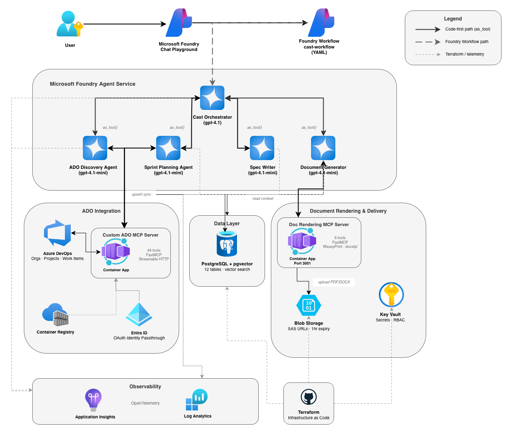

Me and the team spend a lot of time in Azure DevOps. Checking what needs to be worked on, pulling together sprint reports, writing up functional specs from half-finished work items, figuring out capacity before the next planning session. All that time spent operating our boards you forget there's all the technical and people focused work as well sometimes. None of it is hard. All of it is time-consuming. And most of it follows patterns that a well-instructed agent could handle.

So I'm building one.

Cast is a multi-agent system that sits on top of Microsoft Foundry and connects directly into Azure DevOps. You talk to it through a chat interface, it figures out what you need, and it either answers from what it already knows or goes and gets it. Discovery, documentation, sprint planning, spec writing — all through one conversation.

This is a build-in-public series. The code will be fully released on GitHub, the decisions are logged here, and I'll document the whole thing as it goes — including the bits that don't work (spoiler alert there's a lot of this coming).

### What Cast actually does

Four main things, eventually:

- **Project discovery** — connects to ADO organisations and maps the full structure. Orgs, projects, teams, members, sprints, work item hierarchies. All synced to a local database so the agents can query it without hitting the API every time. This data will help drive other tools in the future as well.
- **Documentation generation** — produces sprint reports, user guides, use case documents from templates. Renders to PDF, DOCX, HTML. Delivers via a time-limited download link in the chat. Can also publish to a wiki. (I will eventually add SharePoint Online and Confluence uploading automatically as well)
- **Sprint planning** — reads team capacity (hours, days off, activity split), analyses the backlog, and proposes assignments. There's a human approval step before anything gets written back to ADO, because I'm not letting an LLM reassign work items unsupervised.
- **Functional spec writing** — generates functional specs from notes and dev requests and turns them into official documents. This is then used to create the appropriate work item hierarchy as a starting point for the team. This will be using an iterative loop: draft, clarify, revise, publish. Grounded against a knowledge base so it doesn't hallucinate requirements.

All of it runs through Microsoft Foundry's chat playground. One conversation, multiple agents behind the scenes.

### The architecture

<!-- TODO: Export architecture.drawio as architecture.png via draw.io, then uncomment the image below -->

The system has three tiers: user interaction at the top, the agent layer in the middle, and infrastructure at the bottom. The orchestrator sits in the centre and routes to specialist agents based on what you ask for. Each agent has its own tools — MCP for ADO access, function tools for database operations, blob storage for document delivery.

Two execution paths run through the system. The **code-first path** uses Python scripts where agents call each other via `as_tool()` and the LLM handles routing through its normal tool-calling. The **Foundry Workflow path** uses declarative YAML that Foundry manages as a published agent, with keyword matching to route between agents. Both paths use the same agents and the same infrastructure; they just differ in how routing happens.

### The tech stack and why

A few decisions I made early that shaped everything else.

**Azure AI Foundry Agent Service as the runtime.** I'm not hosting agents in containers or running my own inference. Foundry manages compute, thread persistence, and model routing. The trade-off is less control — you can't run arbitrary Python function tools in the Foundry-managed runtime, which is why the workflow path exists alongside the code-first path. The only containers I run is the MCP servers. The ADO server needed a stable HTTPS endpoint for OAuth specifically!

**Microsoft Agent Framework for orchestration.** This is the successor to Semantic Kernel and AutoGen — RC3 when I started, which felt risky. But the patterns it enforces (typed function tools, `as_tool()` for sub-agent routing, async throughout) are really great and I would have just built this myself anyway. The alternative was rolling my own agent loop, and I've done enough of that to know it's not where I want to spend time on this project.

**gpt-4.1 for the orchestrator, gpt-4.1-mini for sub-agents.** The orchestrator does intent classification across ambiguous requests — "help me plan the next sprint" could mean five different things. That needs a capable model. The sub-agents do bounded, repeatable work (run this WIQL query, render this template) where a smaller model is fine. In an ideal world the orchestrator would be o3/gpt5 for the extended reasoning, but o3/gpt5 availability depends on your subscription and region. gpt-4.1 is a solid stand-in.

**MCP over OpenAPI for ADO access.** This wasn't a preference — it was the only option. OpenAPI tools in Foundry only support static authentication. If you want per-user delegated auth (so each person's ADO permissions apply, with audit trail), you need MCP with OAuth Identity Passthrough. I tried the official Microsoft ADO MCP server first. It's stdio-only, uses browser auth, and can't run headlessly. So I built a custom one in Python with FastMCP and Streamable HTTP transport. That decision snowballed into its own sub-project — more on that in later posts!

**PostgreSQL + pgvector over Cosmos DB.** I went back and forth on this. Cosmos DB is the "Azure-native" choice and has vector search now. But Cast's data is fundamentally relational — organisations contain projects contain teams contain sprints contain work items. A single B1ms Flexible Server in UK South gives me relational queries and vector search for around £10/month. It's stoppable in dev as well to save extra pennies. And I don't need a separate vector database or a sync pipeline between relational and vector stores — pgvector columns sit right next to the data they describe.

**Terraform for infrastructure, ClickOps for Foundry agent config.** Everything that's stable goes through Terraform — PostgreSQL, Key Vault, Container Apps, Storage, App Insights. But Foundry agent configuration (creating agents, connecting tools, assigning models) changes constantly during development. I tried Terraforming it and spent more time fighting the provider than building agents. It lives in the portal and Python SDK for now. This is a deliberate choice, not laziness. Mostly!

**UK South everywhere.** All resources deploy to UK South. Azure OpenAI uses regional deployments (not Global) to keep data in the UK. This matters for the kind of public sector work we deal with at Phoenix so data residency isn't optional.

**Telemetry from day one.** Application Insights is connected before the first agent exists. OpenTelemetry instrumentation goes into every agent via Agent Framework's built-in hooks. I've been burned before by adding observability after the fact — you spend a week instrumenting code that's been running blind for months. Not this time!

### The build phases

Rather than try to ship everything at once, this is built in six phases. Each one produces something testable before the next starts.

1. **Foundation** — Terraform infrastructure, database schema, config, telemetry, basic orchestrator agent
2. **ADO Discovery** — custom MCP server, ADO discovery agent, WIQL tools, capacity reading, database sync
3. **Document Generator** — template registry, HTML/PDF/DOCX rendering, blob storage delivery, workflow chaining
4. **Sprint Planner** — capacity calculator, backlog analysis, human-in-the-loop approval workflow
5. **Spec Writer** — Foundry IQ knowledge base, iterative refinement workflow, spec publishing
6. **Integration & Observability** — full workflow routing, Azure Monitor dashboards, Teams alerting via Logic Apps

Phases 1–3 are done as of now. Phase 4 is next. The articles for those first phases are going to come out daily once I finish writing them and organising my many screenshots and notes. Watch this space!

### Why build this now

Honestly? Because the tooling caught up with the ideas.

MCP OAuth Identity Passthrough in Foundry is the piece that makes per-user ADO access viable without building custom auth plumbing. Agent Framework gives you orchestration patterns that would take months to design from scratch. And the current models I have access to in Foundry ,gpt-4.1, is good enough at reasoning over ambiguous requests that the orchestrator layer actually works reliably.

A year ago, most of this required too much custom infrastructure. The MCP server alone would have been a multi-month project. Now it's a weekend with FastMCP and Container Apps.

This has been such a challenging build so far and since the blog launch I have been non-stop on it after work. The result is incredibly rewarding and I can't wait for me to use this and I hope some other people get to use it to once the repo is public and live!
