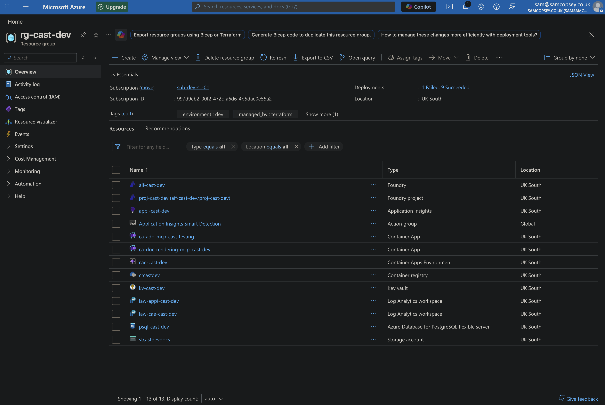
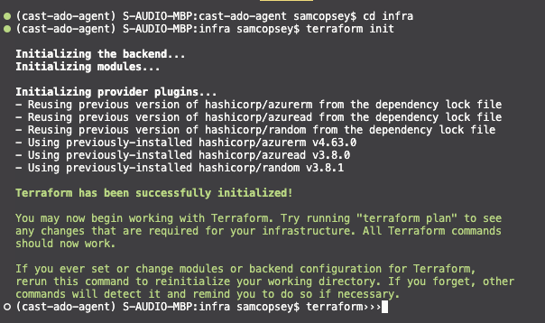
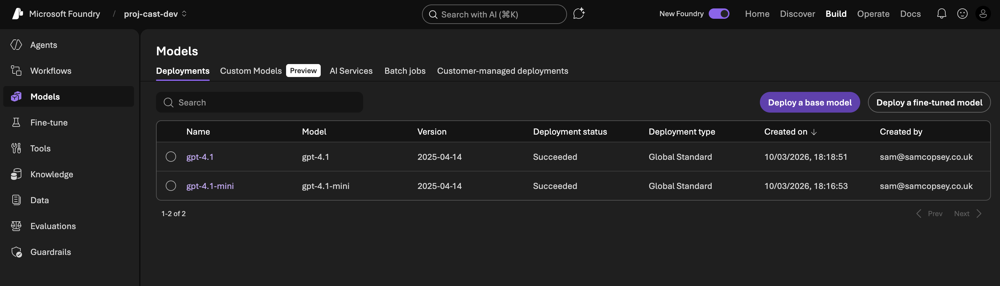

In [Part 1](/blog/cast-part-1-vision-and-architecture) I covered the vision for Cast and the key initial architecture decisions. This post covers getting the Azure infrastructure provisioned using Terraform! The state backend will live in Azure and the first apply will deploy the core dev resources making sure the PostgreSQL server is reachable for local development.

### What we're provisioning

For the foundations of the project, Terraform provisions 10 resources into `rg-cast-dev` in **UK South**:

- **Resource Group** — `rg-cast-dev`
- **Azure Key Vault** — `kv-cast-dev` (RBAC-enabled, purge protection on)
- **Log Analytics Workspace** — `law-appi-cast-dev`
- **Application Insights** — `appi-cast-dev` (connected to Log Analytics)
- **PostgreSQL Flexible Server** — `psql-cast-dev` (B1ms, stoppable, pgvector enabled)
  - Postgres admin password stored as a Key Vault secret
  - Firewall rules for Azure services and your local dev machine

Container Apps, Logic Apps, and alert rules are scaffolded in Terraform but commented out — they come in later phases.



**Azure OpenAI model deployments are not in Terraform.** They go through the Microsoft Foundry portal. Trying to manage model deployments via Terraform runs straight into subscription quota limits and model availability issues that vary by region and subscription type and I couldn't be bothered to deal with that. The Foundry portal handles all of that cleanly, and the config changes frequently enough during development that ClickOps is the right call here. The new Foundry UI is also really nice!

### Step 1: Create the Terraform state backend

Terraform needs somewhere to store state. I use Azure Storage so state is remote and never accidentally committed to the repo.

Run these once manually before `terraform init`:

```bash
az group create --name rg-cast-tfstate --location uksouth

az storage account create \
  --name stcasttfstate \
  --resource-group rg-cast-tfstate \
  --location uksouth \
  --sku Standard_LRS \
  --allow-blob-public-access false

az storage container create \
  --name tfstate \
  --account-name stcasttfstate \
  --auth-mode login

az role assignment create \
  --role "Storage Blob Data Contributor" \
  --assignee $(az ad signed-in-user show --query id -o tsv) \
  --scope $(az storage account show \
    --name stcasttfstate \
    --resource-group rg-cast-tfstate \
    --query id -o tsv)
```

A few things worth noting:

- The storage account name must be **globally unique** — `stcasttfstate` is just an example
- `use_azuread_auth = true` in `backend.tf` means no storage account keys are needed — Entra ID handles access
- The role assignment grants your logged-in identity permission to read/write state

### Step 2: Fill in your tfvars

The repo ships with `infra/environments/dev.tfvars.example`. Copy this, drop the `.example`, and fill it in:

```bash
cp infra/environments/dev.tfvars.example infra/environments/dev.tfvars
```

Three values need filling in before you can plan or apply:

- **`subscription_id`** — your Azure subscription ID (`az account show --query id -o tsv`)
- **`postgres_admin_password`** — pick a strong password; it gets stored in Key Vault automatically by Terraform
- **`developer_ips`** — your public IP for direct PostgreSQL access during local dev (Alembic migrations, psql). `public_network_access_enabled` is set dynamically — it's only enabled when this list is non-empty, so prod stays locked down by default

```hcl
subscription_id         = "your-subscription-id"
postgres_admin_password = "your-strong-password"

developer_ips = [
  { name = "your-name-dev", ip = "your.public.ip" }
]
```

### Step 3: Initialise and apply

```bash
cd infra
terraform init
terraform plan -var-file=environments/dev.tfvars
terraform apply -var-file=environments/dev.tfvars
```

- `terraform init` downloads the AzureRM, AzureAD, and Random providers and connects to the Azure Storage state backend
- `terraform plan` shows 10 resources to create — worth reviewing before applying
- `terraform apply` prompts for confirmation then provisions everything; PostgreSQL takes the longest at around 5 minutes



### Gotcha: Key Vault RBAC propagation

The first apply failed with this:

```bash
Error: checking for presence of existing Secret "postgres-admin-password"
(Key Vault "https://kv-cast-dev.vault.azure.net/"): StatusCode=403
Code="Forbidden" Message="Caller is not authorized to perform action on resource."
```

Terraform created the Key Vault, then immediately assigned the `Key Vault Administrator` role to my identity, then immediately tried to write the postgres password as a Key Vault secret — and got a 403. The role assignment existed but Azure's RBAC control plane hadn't propagated it yet.

This is a known race condition with Azure RBAC. Role assignments can take anywhere from a few seconds to a few minutes to propagate, and Terraform doesn't know to wait.

The fix is a `time_sleep` resource in the keyvault module that blocks for 90 seconds after the role assignment is created. The Key Vault outputs (`key_vault_id`, `key_vault_uri`) are set to depend on the sleep, so anything downstream — including the PostgreSQL module writing the secret — automatically waits.

```hcl
resource "time_sleep" "rbac_propagation" {
  depends_on      = [azurerm_role_assignment.deployer_admin]
  create_duration = "90s"
}

output "key_vault_id" {
  value      = azurerm_key_vault.this.id
  depends_on = [time_sleep.rbac_propagation]
}
```

This required adding the `hashicorp/time` provider, then re-running `terraform init` before applying again. On the second apply Terraform only retried the failed resource (the secret) — everything else was already in state.

It adds 90 seconds to fresh deploys but only runs once on creation. Worth it to avoid a manual retry every time.

### Step 4: Grab the outputs

Once applied, pull the values you need for your `.env` file:

```bash
terraform output postgres_host
terraform output -raw app_insights_connection_string
```

These go into your local `.env` as `POSTGRES_HOST` and `APPLICATION_INSIGHTS_CONNECTION_STRING`.

### Step 5: Set up Microsoft Foundry

This is the ClickOps part. Head to [ai.azure.com](https://ai.azure.com) and:

1. **Create a Hub** in UK South, inside `rg-cast-dev`. When prompted, connect it to the existing Key Vault (`kv-cast-dev`) and Application Insights instance.
2. **Create a Project** inside the hub — I called mine `cast-dev`.
3. **Deploy models** from the Model catalog → Deployments.

The architecture calls for **o3** as the orchestrator model and **gpt-4.1-mini** for sub-agents. In practice, model availability depends on your subscription type, region, and quota. At the time of writing, o3 wasn't available on my subscription and UK South only supported Global deployments — not the regional deployments you'd want for strict UK sovereignty.

For development, I deployed:

| Model | Deployment name | Role | TPM | Deployment type |
|-------|----------------|------|-----|-----------------|
| **gpt-4.1** | `gpt-4.1` | Orchestrator (o3 stand-in) | 30K | Global |
| **gpt-4.1-mini** | `gpt-4.1-mini` | Sub-agents | 60K | Global |



GPT-4.1 is a capable stand-in for o3 — it handles tool use and multi-step reasoning well, it just lacks o3's extended chain-of-thought. For the orchestrator's job of intent classification and agent routing, it's more than sufficient.

**In production, you'd want:**

- **o3** (or whatever the current reasoning model is) for the orchestrator, if your subscription and region support it
- **Data Zone Standard** in UK South to guarantee data residency — Global deployments route to the nearest available Azure data centre, which may not be in the UK
- Higher TPM limits based on actual usage patterns

Note: I have been playing with the new (at the time of writing this post) gpt5.4 release with x-high reasoning enabled recently. It's very good and if I had that in my environment I would use it!

The 30K/60K TPM split reflects the different workload profiles: the orchestrator makes fewer but larger calls (planning, routing), while sub-agents run in parallel and handle more volume. These are easy to adjust later without redeploying.

Once the project is created, grab the **Project endpoint** from the Overview page — it looks like `https://YOUR_PROJECT.services.ai.azure.com/api/projects/YOUR_PROJECT_NAME`. This goes into your `.env` as `AZURE_AI_FOUNDRY_PROJECT_ENDPOINT`.

### What's next

With the infrastructure provisioned and Foundry configured, the next step is building the first agent — the orchestrator — using Microsoft Agent Framework.
