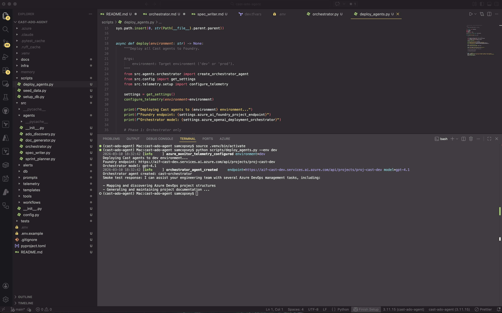
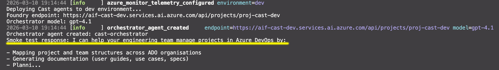
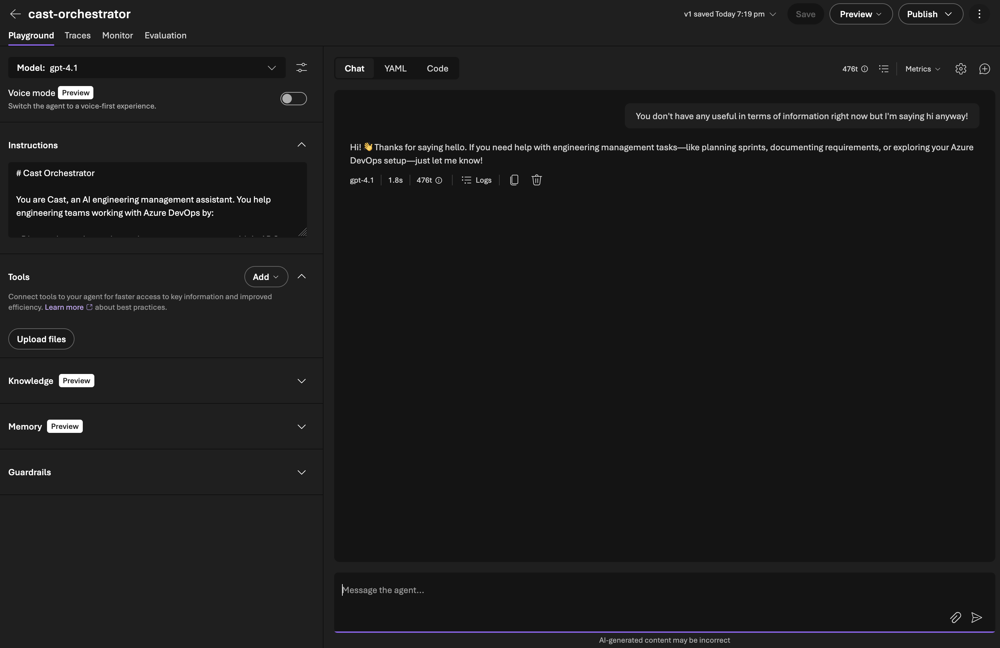
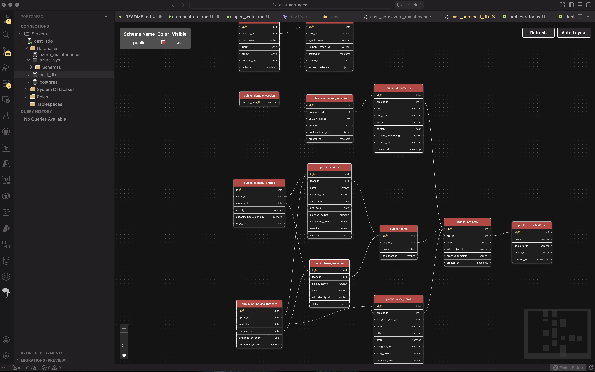

In [Part 2](/blog/cast-part-2-provisioning-azure-infrastructure) I provisioned the Azure infrastructure and configured Foundry with model deployments. In this article we'll build our first actual agent! To start with we need a really simple orchestrator to handle our multi-agent turns.

### Microsoft Agent Framework in March 2026

Agent Framework hit **1.0.0rc3** on March 4, 2026. It's the successor to both Semantic Kernel and AutoGen — Microsoft's unified framework for building agents in Python and .NET. The Python package is `agent-framework-azure-ai`, installed with the `--pre` flag since it's still a release candidate.

```bash
pip install agent-framework-azure-ai --pre
```

This pulls in `agent-framework-core`, `azure-ai-agents`, MCP support, and OpenTelemetry instrumentation. It's a substantial dependency tree, which matters when you're combining it with other Azure packages, more on that shortly.

### Choosing the right client type

Agent Framework offers three Azure OpenAI client types, each targeting a different API:

| Client | API | Server-managed | Portal visible |
|--------|-----|----------------|----------------|
| `AzureOpenAIChatClient` | Chat Completions | No | No |
| `AzureOpenAIResponsesClient` | Responses | No | No |
| `AzureAIAgentClient` | Foundry Agent Service | Yes | Yes |

I initially went with `AzureOpenAIResponsesClient` from Agent Framework because the quickstart tutorial uses it and it has the richest tool support (code interpreter, file search, web search, hosted MCP). It worked a treat, the agent ran and responded to messages. But the agent only existed in my code. It didn't appear in the Foundry portal, and conversations weren't persisted server-side. Part of this build for me was to really test the limits of Foundry so I can better utilise it at work so getting into on-platform was crucial.

I then tried `AzureAIAgentClient` (also from Agent Framework), which wraps the Foundry Agent Service. This created a server-managed agent that appeared in the portal — but as a **Classic Agent**, because `AzureAIAgentClient` uses the old Assistants API under the hood. Not quite what we wanted.

What I eventually settled on is `AzureAIProjectAgentProvider` from Agent Framework. This wraps the Foundry Agent Service properly, creates non-classic agents using `create_version()` internally, and gives you the higher-level `Agent` abstraction with `FunctionTool` support and the `as_tool()` pattern for sub-agent routing. More on this evolution shortly.

| Approach | API | Portal visibility | Classic? |
|----------|-----|-------------------|----------|
| `AzureOpenAIResponsesClient` (Agent Framework) | Responses | No (client-side only) | N/A |
| `AzureAIAgentClient` (Agent Framework) | Assistants | Yes | Yes (classic) |
| `AzureAIProjectAgentProvider` (Agent Framework) | New Agent Service | Yes | No |

### Creating the orchestrator agent

The orchestrator is Cast's front door. It receives user messages, classifies intent, and routes to specialist sub-agents. For now it's the only agent — sub-agents come in later phases.

My initial approach used the raw `azure-ai-projects` SDK directly, `create_version()` with `PromptAgentDefinition`:

```python
# Raw SDK approach
from azure.ai.projects import AIProjectClient
from azure.ai.projects.models import PromptAgentDefinition
from azure.identity import DefaultAzureCredential

project = AIProjectClient(
    endpoint="https://cast-dev-endpoint.services.ai.azure.com/api/projects/proj-cast-dev",
    credential=DefaultAzureCredential(),
)

agent = project.agents.create_version(
    agent_name="cast-orchestrator",
    definition=PromptAgentDefinition(
        model="gpt-4.1",
        instructions=open("src/prompts/orchestrator.md").read(),
    ),
)
```

This worked. The agent appeared in the Foundry portal as a non-classic agent. But running conversations required dropping down to the OpenAI client's `conversations` and `responses` APIs, and tool call dispatch was entirely manual.

Once Agent Framework RC3 landed, the higher-level abstractions made this much cleaner.

### Agent Framework RC3: the better pattern

Agent Framework's `AzureAIProjectAgentProvider` wraps `create_version()` internally but gives you an `Agent` object with built-in session management, tool dispatch, and the `as_tool()` pattern for sub-agent routing:

```python
from agent_framework_azure_ai import AzureAIProjectAgentProvider
from azure.ai.projects.aio import AIProjectClient
from azure.identity.aio import DefaultAzureCredential

provider = AzureAIProjectAgentProvider(
    project_client=AIProjectClient(
        endpoint=settings.azure_ai_foundry_project_endpoint,
        credential=DefaultAzureCredential(),
    )
)

orchestrator = await provider.create_agent(
    name="cast-orchestrator",
    model="gpt-4.1",
    instructions=open("src/prompts/orchestrator.md").read(),
    tools=[],  # Sub-agent tools added in later Phase 2
)
```

I used the **`deploy_agents.py`** script to deploy my first agent and off it went!


A few things worth noting:

- **`AzureAIProjectAgentProvider`** handles the Foundry-specific agent creation. It calls `create_version()` internally but returns an `Agent` with higher-level methods.
- **`Agent`** replaces the raw SDK response. You get `create_session()`, `run()`, and `as_tool()`. There is no manual thread/response management.
- **Async by default.** Note the `aio` imports. Agent Framework uses async throughout.
- **`DefaultAzureCredential`** handles auth via `az login` for local dev. In production you'd use `ManagedIdentityCredential`.
- **`model`** maps to the deployment name in your Foundry project, not the model name. So `"gpt-4.1"` here refers to the deployment we created in Part 2.

### The deploy script

A simple script creates the agent and runs a smoke test:

```python
session = orchestrator.create_session()
response = await orchestrator.run("Hello, what can you help me with?", session=session)
print(response.text)
```

Compare that to the raw SDK approach, which required creating conversations and responses manually with `agent_reference` in `extra_body`. The Agent Framework abstraction handles session (thread) management and response parsing automatically.



### Gotcha: portal propagation delay

After running the deploy script, the agent didn't appear in the Foundry portal immediately. The SDK confirmed it existed (`project.agents.list()` returned it), but the portal's Agents page showed "Create your first agent" for several minutes. It eventually appeared. Just a propagation delay. Don't panic if you don't see it straight away (I did a little of this).



### Gotcha: OpenTelemetry version conflict

After installing `agent-framework-azure-ai`, the first attempt to run the deploy script failed:

```
ImportError: cannot import name 'LogData' from 'opentelemetry.sdk._logs'
```

Agent Framework pulled in `opentelemetry-sdk` 1.40.0, but the existing `azure-monitor-opentelemetry-exporter` (1.0.0b45) hadn't been built against that version. The `LogData` class moved between OTel SDK releases, breaking the Azure Monitor exporter's import.

The fix:

```bash
uv pip install --upgrade azure-monitor-opentelemetry azure-monitor-opentelemetry-exporter
```

This bumped the exporter to 1.0.0b48, compatible with the newer OTel SDK. Worth keeping in mind if you're combining Agent Framework with Azure Monitor telemetry. In production I wouldn't be using pre-release packages so they should play ball but if you're planning to test out the pre-release, the packages don't always pin compatible versions of each other.

## Setting up PostgreSQL with pgvector

With the orchestrator agent running, the next piece of Phase 1 is the database. Cast uses PostgreSQL Flexible Server with the pgvector extension. A single service handling both structured relational data and vector similarity search.

### Why PostgreSQL over Cosmos DB

Foundry's own conversation persistence handles chat threads (up to 100,000 messages per conversation), so Cast doesn't need a database for that. What it does need is somewhere to store domain data: ADO organisations, projects, teams, sprints, work items, documents, and the operational data from agent sessions. If we just relied on gathering the information fresh every time, we'd be overworking our MCP tool usage and draining context. Having the data stored centrally will allow us to do something interesting with it in the future.

PostgreSQL Flexible Server on a B1ms SKU costs around £10/month in UK South, and the server is stoppable. Cosmos DB's cheapest tier is significantly more expensive for a workload that's fundamentally relational.

The pgvector extension adds vector columns directly to existing tables. Work item descriptions and document content get embedded as 1536-dimension vectors (matching OpenAI's embedding models) and stored alongside the relational data they belong to. No separate vector database, no sync pipeline, no eventual consistency issues between your relational and vector stores. Sorted.

### The schema

Cast's schema has 12 tables across three groups:

**Core domain** — the ADO data model:

```
organisations → projects → teams → team_members
                         → work_items (with content_embedding vector(1536))
                teams   → sprints
```

**Document management**:

```
documents (with content_embedding vector(1536)) → document_versions
```

**Agent operational data**:

```
agent_sessions → agent_tool_calls
sprints → capacity_entries
sprints + work_items + team_members → sprint_assignments
```

The vector columns on `work_items` and `documents` enable similarity search — finding work items that are similar to a new requirement, or documents that cover related topics. These get populated later when the ADO Discovery and Document Generator agents sync data.

### SQLAlchemy 2.0 models with pgvector

Each table is defined as a SQLAlchemy 2.0 model using `mapped_column` and type annotations. The pgvector columns use the `Vector` type from the `pgvector` Python package:

```python
from pgvector.sqlalchemy import Vector
from sqlalchemy.orm import DeclarativeBase, Mapped, mapped_column

class WorkItem(Base):
    __tablename__ = "work_items"

    id: Mapped[int] = mapped_column(primary_key=True)
    project_id: Mapped[int] = mapped_column(ForeignKey("projects.id"))
    ado_work_item_id: Mapped[int] = mapped_column(nullable=False)
    type: Mapped[str] = mapped_column(String(50), nullable=False)
    title: Mapped[str] = mapped_column(String(500), nullable=False)
    description: Mapped[str | None] = mapped_column(Text)
    content_embedding: MappedColumn[list[float] | None] = mapped_column(Vector(1536))
    # ... other columns
```

SQLAlchemy's type annotation style gives you full IDE autocomplete and type checking, and the pgvector `Vector(1536)` type maps directly to PostgreSQL's `vector` column type.

### Async Alembic migrations

Cast uses async everywhere! `asyncpg` for the database driver, `async_sessionmaker` for sessions. Alembic doesn't natively support async, but it has a well-documented pattern using `async_engine_from_config` and `run_sync`:

```python
# env.py (simplified)
from sqlalchemy.ext.asyncio import async_engine_from_config

async def run_async_migrations() -> None:
    connectable = async_engine_from_config(
        config.get_section(config.config_ini_section, {}),
        prefix="sqlalchemy.",
        poolclass=pool.NullPool,
    )

    async with connectable.connect() as connection:
        await connection.execute(text("CREATE EXTENSION IF NOT EXISTS vector"))
        await connection.commit()
        await connection.run_sync(do_run_migrations)
```

The `CREATE EXTENSION IF NOT EXISTS vector` runs before every migration to ensure pgvector is available. This is idempotent and only creates the extension on the first run.

The DSN comes from Cast's `Settings` class (pydantic-settings), so migrations use the same config as the application:

```python
settings = get_settings()
config.set_main_option("sqlalchemy.url", settings.postgres_dsn)
```

### Gotcha: autogenerated migrations and pgvector

When you run `alembic revision --autogenerate`, Alembic detects all the tables and columns from your models. But the autogenerated migration file references `pgvector.sqlalchemy.vector.VECTOR` without importing the module:

```python
# Autogenerated — this fails
sa.Column('content_embedding', pgvector.sqlalchemy.vector.VECTOR(dim=1536))
```

```
NameError: name 'pgvector' is not defined
```

The fix is adding `import pgvector.sqlalchemy.vector` to the migration file. To avoid this on every future migration, I added the import to Alembic's `script.py.mako` template so it's included automatically.

### Gotcha: database doesn't exist

Terraform provisioned the PostgreSQL Flexible Server but not the `cast_db` database itself. The first migration attempt failed with `InvalidCatalogNameError: database "cast_db" does not exist`. Created it via the Azure CLI:

```bash
az postgres flexible-server db create \
  --resource-group rg-cast-dev \
  --server-name psql-cast-dev \
  --database-name cast_db
```

This is something I should have added to the Terraform PostgreSQL module. We know for next time!

### Running the migration

With every issue resolved, the migration ran cleanly:

```
INFO  [alembic.autogenerate.compare.tables] Detected added table 'organisations'
INFO  [alembic.autogenerate.compare.tables] Detected added table 'projects'
INFO  [alembic.autogenerate.compare.tables] Detected added table 'teams'
INFO  [alembic.autogenerate.compare.tables] Detected added table 'team_members'
INFO  [alembic.autogenerate.compare.tables] Detected added table 'work_items'
INFO  [alembic.autogenerate.compare.tables] Detected added table 'sprints'
INFO  [alembic.autogenerate.compare.tables] Detected added table 'documents'
INFO  [alembic.autogenerate.compare.tables] Detected added table 'document_versions'
INFO  [alembic.autogenerate.compare.tables] Detected added table 'agent_sessions'
INFO  [alembic.autogenerate.compare.tables] Detected added table 'agent_tool_calls'
INFO  [alembic.autogenerate.compare.tables] Detected added table 'capacity_entries'
INFO  [alembic.autogenerate.compare.tables] Detected added table 'sprint_assignments'
```

12 tables, two pgvector columns, all foreign keys and indexes in place.



### What's next

Phase 1 is complete. The orchestrator agent is running on Foundry, the database schema is deployed with pgvector, and telemetry is flowing to App Insights. In Part 4, we start Phase 2 — the ADO Discovery agent that connects to Azure DevOps via MCP and syncs project data into PostgreSQL.
