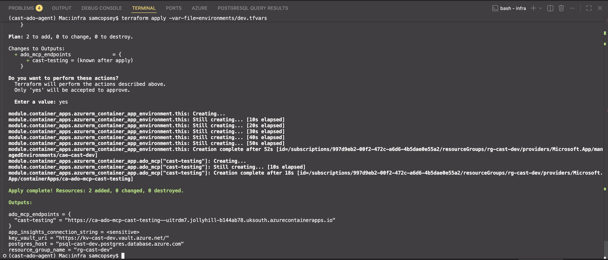
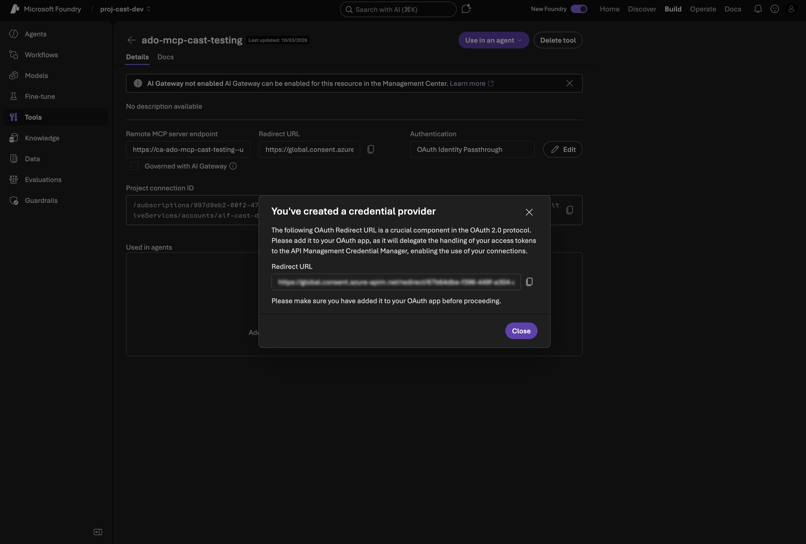
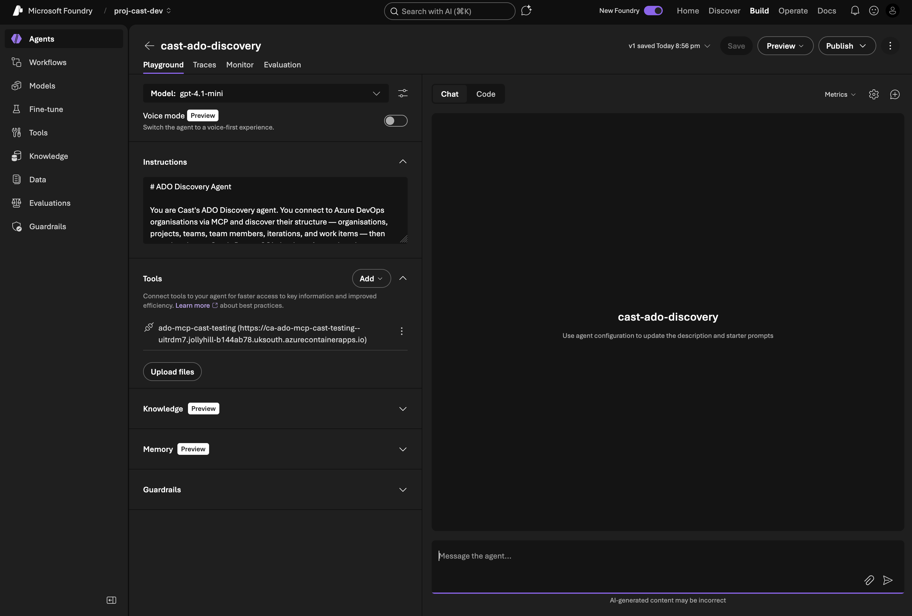
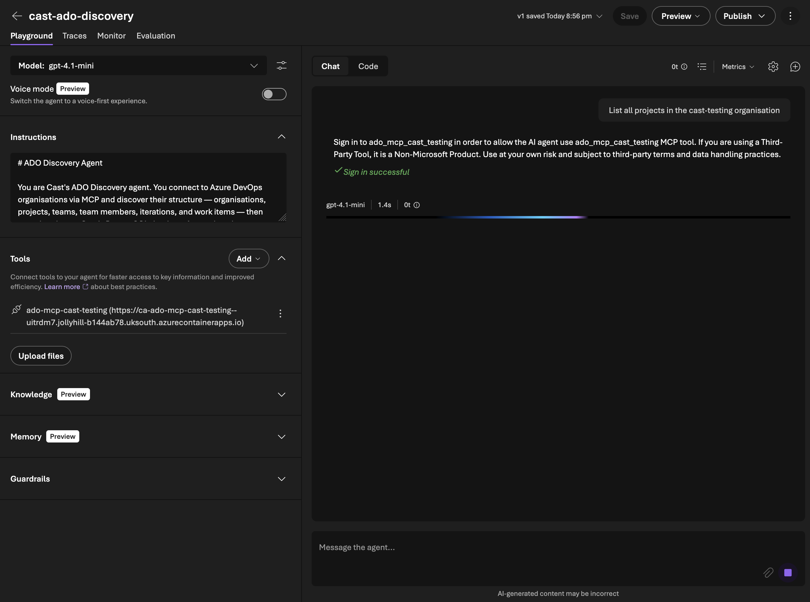
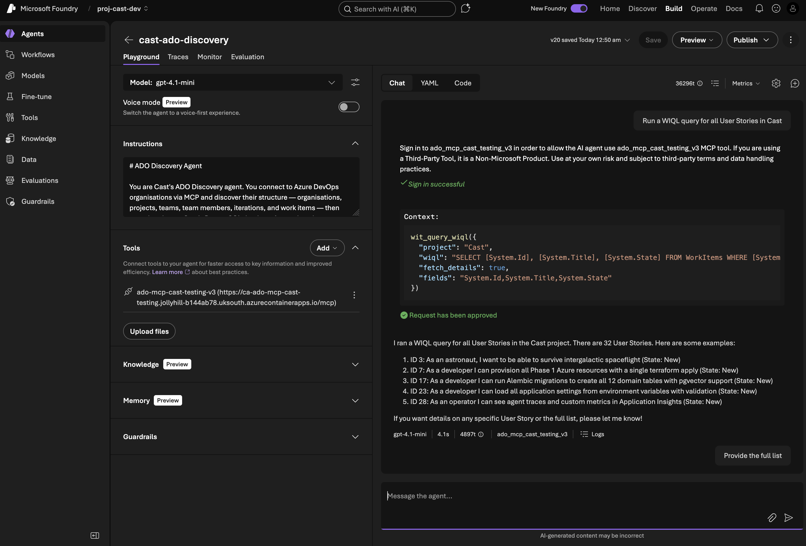
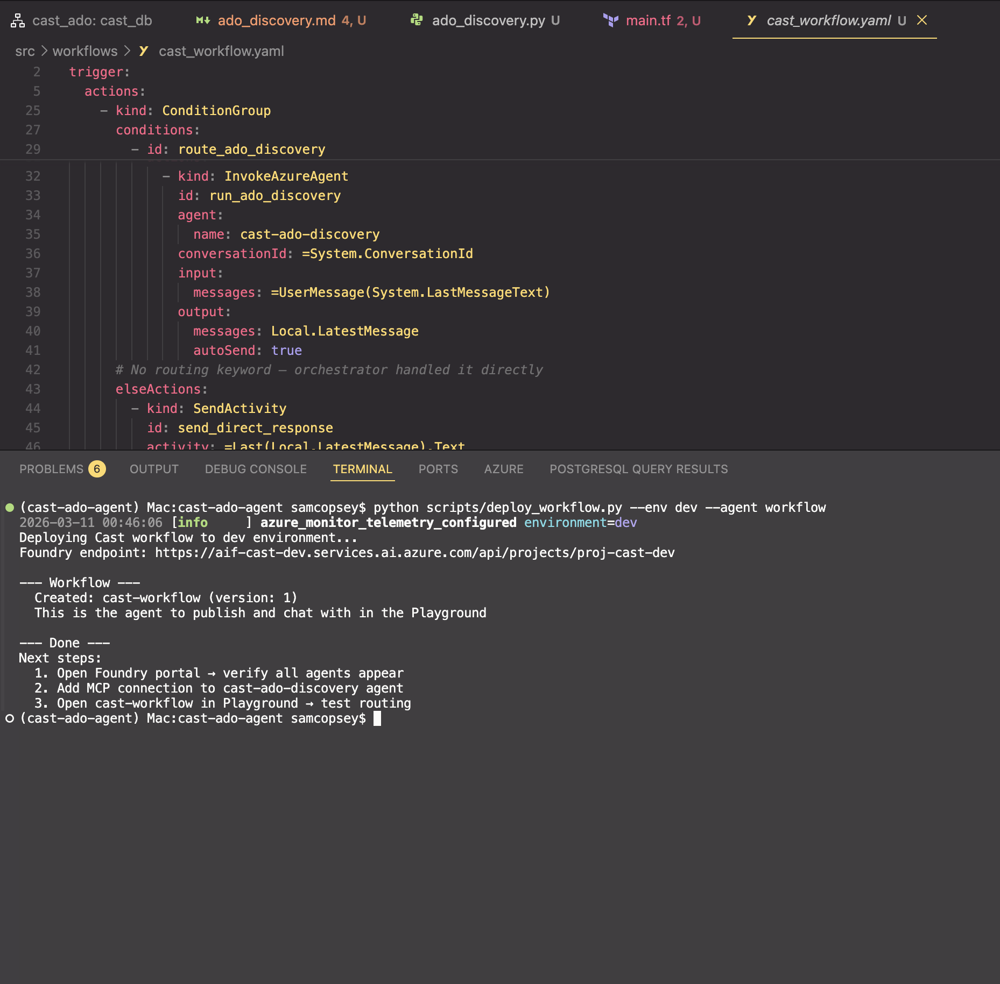
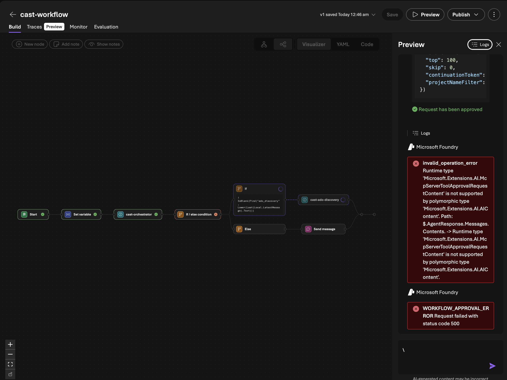
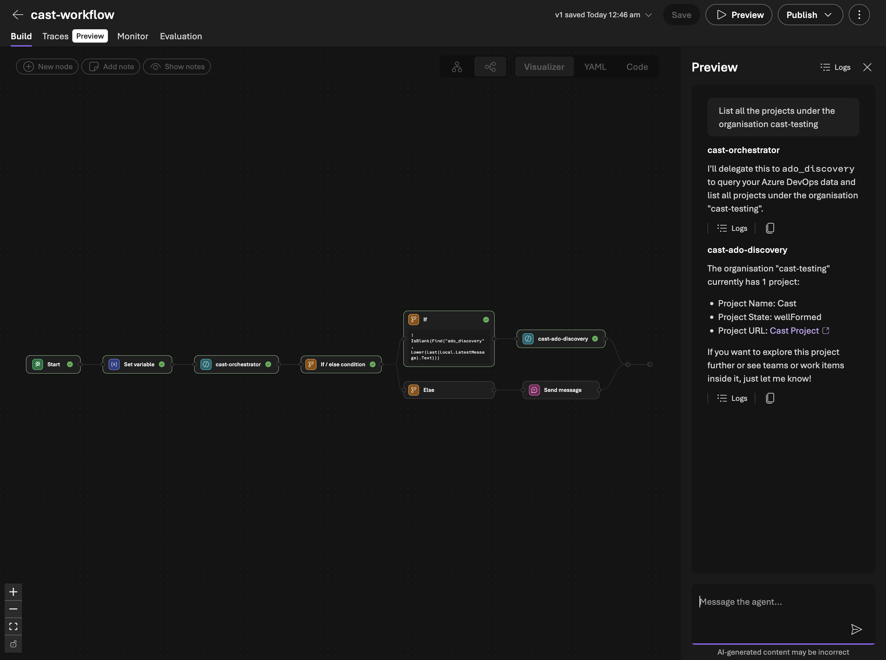

In [Part 3](/blog/cast-part-3-first-agent) I got the orchestrator agent running on Foundry and set up PostgreSQL with pgvector. Now it's time for the first *real* agent that actually does something. The ADO Discovery agent connects to Azure DevOps organisations, reads their project structure, and syncs the data into Cast's database.

<video src="/videos/cast-part-4/agent-demo.mp4" autoplay loop muted playsinline></video>
<span class="video-caption">The ADO Discovery agent in action — querying Azure DevOps via MCP</span>

## What we're building

The ADO Discovery agent needs to:

1. **Read from ADO:** organisations, projects, teams, members, iterations, work items
2. **Query work item hierarchies:** Epic → Feature → Story → Task trees via WIQL
3. **Fetch capacity data:** Team member hours per sprint, days off, activity types
4. **Sync everything to PostgreSQL:** Upsert records so other agents can query them
5. **Route from the orchestrator:** The orchestrator classifies intent and hands off

The read side uses Azure DevOps MCP servers hosted on Container Apps. The write side uses function tools that call async SQLAlchemy against the PostgreSQL instance.

## Hosting the ADO MCP server

Cast uses MCP (Model Context Protocol) for ADO access because it's the only Foundry mechanism that supports **per-user delegated authentication** through the chat interface. OpenAPI tools only support static auth either API keys or managed identity. MCP with OAuth Identity Passthrough means each user's own ADO permissions are used, which gives you a proper audit trail.

For Foundry to reach the MCP server, it needs to be hosted somewhere accessible over HTTPS. Container Apps is the natural fit they are lightweight, scale-to-zero capable, and cheap.

### What didn't work: the Node.js bridge

My first attempt was to host Microsoft's official [`@azure-devops/mcp`](https://github.com/microsoft/azure-devops-mcp) package on Container Apps. This is a Node.js server that exposes ADO APIs as MCP tools. It's the same one you'd use locally with VS Code.

```hcl
# This doesn't work — the ADO MCP server only supports stdio transport
command = ["npx", "-y", "@azure-devops/mcp", each.key, "-d", "core", "work-items", "wiki", "repositories"]
```

The container started, immediately exited with code 0, and crash-looped. The `@azure-devops/mcp` package is **stdio-only** — it reads from stdin, gets nothing, and exits. Foundry expects an HTTP endpoint.

**Gotcha:** The [`@azure-devops/mcp`](https://github.com/microsoft/azure-devops-mcp) package only supports stdio transport. The README and docs only show `"type": "stdio"` configurations — there's no `--http` flag or server mode.

I then built a Node.js bridge server that spawned the ADO MCP server as a child process and proxied requests between [Streamable HTTP](https://modelcontextprotocol.io/docs) and stdio. The pattern came from Microsoft's own [MCP Container Apps sample](https://github.com/Azure-Samples/mcp-container-ts).

It worked, but it couldn't pass OAuth tokens from Foundry through to the underlying stdio process. The `@azure-devops/mcp` server uses interactive browser auth and there's no way to inject a token. For a single-user dev setup this was fine, but for production with multiple users each needing their own ADO permissions, it was a dead end.

#### The solution: a custom Python MCP server

The fix was building an MCP server from scratch. Python, [`mcp SDK`](https://github.com/modelcontextprotocol/python-sdk) with Streamable HTTP transport, calling the ADO REST API directly with whatever OAuth token Foundry sends. No more stdio bridge, no more child processes, full control over auth.

```python
from mcp.server.fastmcp import FastMCP
from mcp.server.transport_security import TransportSecuritySettings

mcp = FastMCP(
    "ado-mcp-server",
    stateless_http=True,
    json_response=True,
    transport_security=TransportSecuritySettings(
        enable_dns_rebinding_protection=False,  # Behind Container Apps proxy
    ),
)

@mcp.tool()
async def core_list_projects(ctx: Context, stateFilter: str = "wellFormed") -> str:
    """Retrieve a list of projects in your Azure DevOps organization."""
    client = ADOClient(get_org(ctx), get_token(ctx))
    try:
        result = await client.get("/_apis/projects", params={"stateFilter": stateFilter})
        return json.dumps(result)
    finally:
        await client.close()
```

`FastMCP` handles all the protocol negotiation, initialisation, tools/list, tools/call, and serves it over HTTP. `stateless_http=True` means no session state, so it scales horizontally on Container Apps without sticky sessions. Each tool is a decorated async function where `ctx` gives access to the MCP request context, including the OAuth Bearer token from Foundry.

The `ADOClient` is a thin `httpx.AsyncClient` wrapper that detects whether the token is a JWT (Bearer auth) or a PAT (Basic auth) and sets headers accordingly. All calls go through the ADO REST API v7.1.

The Docker image is tiny. Just `python:3.11-slim`, pip install, done:

```dockerfile
FROM python:3.11-slim
WORKDIR /app
COPY pyproject.toml README.md ./
COPY src/ src/
RUN pip install --no-cache-dir .
EXPOSE 3000
CMD ["python", "-m", "ado_mcp_server"]
```

The server itself is going to be a separate public repo soon. It started with 3 core tools (`core_list_projects`, `core_list_project_teams`, `core_get_identity_ids`). The plan is to increase the tool count until it has feature parity with Microsoft's ADO MCP server.

### Expanding the tool set: v0.4.0

The 3 core tools proved the architecture worked! OAuth tokens flowing through Foundry, Container Apps serving MCP, the discovery agent calling tools. But Cast also had function tools in `src/tools/ado_tools.py`: WIQL queries, iterations, capacity, all using a static token that bypasses per-user OAuth. Those needed MCP equivalents too.

v0.4.0 added 12 work item read tools to the MCP server:

| Tool | What it does |
|------|-------------|
| `wit_query_wiql` | Execute ad-hoc WIQL queries with optional detail fetching |
| `wit_get_work_item` | Single work item with parent/child relations |
| `wit_get_work_items_batch` | Multiple items by ID (batched at 200) |
| `wit_get_work_items_for_iteration` | All items in a sprint |
| `wit_my_work_items` | Items assigned to the current user (`@Me`) |
| `wit_list_backlogs` | Backlog levels for a team |
| `wit_list_backlog_work_items` | Items in a specific backlog |
| `wit_get_work_item_type` | Field definitions, states, transitions for a WIT |
| `wit_list_fields` | All fields (system + custom) for a project |
| `wit_get_team_iterations` | Sprint schedules with timeframe filter |
| `wit_get_team_capacity` | Pre-calculated available hours per member |

The tools follow the same pattern as the core tools; `@mcp.tool()` decorated async functions; `ADOClient` for REST calls; and JSON string return. A shared `_fetch_work_item_details` helper handles the 200-item batching that the ADO API requires.

### Custom field extensibility

One design decision worth calling out: rather than hardcoding field names, the tools support **runtime field discovery**. The workflow is:

1. Agent calls `wit_list_fields` to discover available fields — including `Custom.TShirtSize`, `Custom.BusinessValue`, or whatever an org uses
2. Agent passes discovered reference names to `wit_query_wiql`, `wit_get_work_item`, or `wit_get_work_items_batch` via the `fields` parameter
3. Custom fields appear in the response with their reference names as keys

This means orgs using custom work item types or non-standard fields work without code changes — the agent discovers the schema at runtime.

### Why not just use the official MCP server?

At this point it's worth stepping back and asking: why build a custom MCP server when Microsoft provides an [official one](https://github.com/microsoft/azure-devops-mcp) with 87 tools across 9 domains?

The answer comes down to two fundamental limitations:

| Capability | Official (`@azure-devops/mcp`) | Custom (`ado-mcp-server`) |
|---|---|---|
| **Transport** | stdio only | Streamable HTTP |
| **Auth** | Interactive browser login | OAuth Identity Passthrough |
| **Foundry compatible** | No | Yes |
| **Per-user permissions** | No | Yes |
| **Headless deployment** | No | Yes (Container Apps) |
| **WIQL queries** | No (saved queries only) | Yes, ad-hoc WIQL |
| **Custom field discovery** | No | Yes — `wit_list_fields` |
| **Total tools** | 87 | 15 |

The official server is stdio-only. It reads from stdin, which means it can't run on Container Apps or any remote host. Foundry needs an HTTPS endpoint. And it uses interactive browser auth. Every user would need to complete a browser login on the server, which doesn't work headlessly.

Beyond the transport and auth blockers, our server has capabilities the official one lacks:

- **Ad-hoc WIQL** — the official server only supports saved queries (execute by query ID). Our server lets agents compose and execute arbitrary WIQL, which is essential for dynamic queries like "show me all User Stories in Sprint 3 assigned to Sam".
- **Custom field discovery** — `wit_list_fields` lets agents find org-specific fields at runtime. The official server has no equivalent.
- **Pre-calculated capacity** — `wit_get_team_capacity` returns total available hours (capacity × working days − days off), not just raw API data. The agent doesn't need to do arithmetic.

The official server wins on breadth still with pipelines (14 tools), repositories (21 tools), test plans (9 tools), wiki (6 tools). Those domains are on our roadmap as prioritised by what Cast's agents actually need to operate.

**Gotcha:** Don't confuse "87 tools" with "87 useful tools for your use case". The official server's breadth covers domains like Advanced Security and Test Plans that Cast doesn't need. Focus on what your agents actually call. For Cast, that's work items, iterations, capacity, and eventually repos and wiki.

### Terraform for Container Apps

The module was scaffolded in Phase 1 but commented out. Activating it in `infra/main.tf`:

```hcl
module "container_apps" {
  source = "./modules/container_apps"

  name_prefix         = local.name_prefix
  resource_group_name = azurerm_resource_group.main.name
  location            = var.location
  ado_organisations   = var.ado_organisations
  key_vault_id        = module.keyvault.key_vault_id
  tags                = local.tags
}
```

The Container Apps module creates one Container App per ADO organisation:

```hcl
resource "azurerm_container_app" "ado_mcp" {
  for_each = toset(var.ado_organisations)

  name                         = "ca-ado-mcp-${each.key}"
  container_app_environment_id = azurerm_container_app_environment.this.id
  resource_group_name          = var.resource_group_name
  revision_mode                = "Single"

  template {
    container {
      name   = "ado-mcp"
      image  = "${azurerm_container_registry.this.login_server}/ado-mcp-server:${var.mcp_server_image_tag}"
      cpu    = 0.25
      memory = "0.5Gi"

      env {
        name  = "AZURE_DEVOPS_ORG"
        value = each.key
      }

      # MCP_API_KEY deliberately not set — Foundry can't pass custom headers
    }

    min_replicas = 1
    max_replicas = 1
  }

  ingress {
    external_enabled = true
    target_port      = 3000
    transport        = "http"
  }
}
```

Key decisions:

- **`min_replicas = 1`** — avoids Foundry timeouts on cold start. The MCP server starts fast but Container Apps cold start adds latency.
- **Versioned image tags** — using `var.mcp_server_image_tag` (e.g., `v0.4.0`) instead of `:latest`. Container Apps won't pull a new image if the tag hasn't changed, so reusing `:latest` means your changes silently don't deploy.
- **One app per org** — each ADO organisation gets its own MCP endpoint, which keeps the auth scope clean.
- **ACR with admin auth** — simplest registry auth for Container Apps in dev. Production would use managed identity.

To deploy, add your org names to `environments/dev.tfvars`:

```hcl
ado_organisations = [
  "my-ado-org"
]
```

```bash
# 1. Apply Terraform (creates ACR, Container App Environment, Container App)
cd infra
terraform plan -var-file=environments/dev.tfvars
terraform apply -var-file=environments/dev.tfvars

# 2. Build and push the MCP server image to ACR (from the ado-mcp-server repo)
ACR_NAME=$(terraform output -raw acr_name)
ACR_SERVER=$(terraform output -raw acr_login_server)
az acr login --name $ACR_NAME
docker build --platform linux/amd64 -t $ACR_SERVER/ado-mcp-server:v0.4.0 /path/to/ado-mcp-server/
docker push $ACR_SERVER/ado-mcp-server:v0.4.0

# 3. Deploy with the versioned tag
terraform apply -var-file=environments/dev.tfvars -var='mcp_server_image_tag=v0.4.0'
```



**Gotcha:** The MCP Python SDK includes DNS rebinding protection that validates the `Host` header on incoming requests. Behind a reverse proxy like Container Apps, the Host header is the external FQDN, which doesn't match what the server expects. You'll get a mysterious `421 Invalid Host header` response. The fix is `TransportSecuritySettings(enable_dns_rebinding_protection=False)` which in this case is safe because Container Apps handles ingress security.

The output gives you the MCP endpoint URLs:

```bash
terraform output ado_mcp_endpoints
# {
#   "cast-testing" = "https://ca-ado-mcp-cast-testing.jollyhill-xxxxx.uksouth.azurecontainerapps.io"
# }
```

### Connecting the MCP server to Foundry

The Container App is running, but Foundry doesn't know about it yet. You need to add it as an MCP tool connection in the portal with OAuth Identity Passthrough. This is what lets each user authenticate with their own ADO credentials.

**Step 1: Create an Entra ID App Registration**

The OAuth flow needs an app registration that has permission to access Azure DevOps on behalf of users. In the Azure portal:

1. Go to **Microsoft Entra ID** → **App registrations** → **New registration**
2. Name it something like `cast-ado-mcp`
3. **Leave the Redirect URI blank for now** — Foundry generates it after you save the MCP connection (chicken-and-egg problem)
4. Under **API permissions**, add **Azure DevOps** → **user_impersonation** (Delegated)
5. Under **Certificates & secrets**, create a new client secret and copy the value

You'll need the **Application (client) ID**, the **client secret**, and your **tenant ID** (from the Overview page).

**Step 2: Add the MCP tool connection in Foundry**

In the [AI Foundry portal](https://ai.azure.com), navigate to your project and add a new MCP tool:

| Field | Value |
|-------|-------|
| **Name** | `ado-mcp-cast-testing` |
| **Remote MCP Server endpoint** | The Container App URL from the Terraform output |
| **Authentication** | OAuth Identity Passthrough |
| **Client ID** | Application (client) ID from your app registration |
| **Client secret** | The secret value you created |
| **Token URL** | `https://login.microsoftonline.com/{tenant-id}/oauth2/v2.0/token` |
| **Auth URL** | `https://login.microsoftonline.com/{tenant-id}/oauth2/v2.0/authorize` |
| **Refresh URL** | `https://login.microsoftonline.com/{tenant-id}/oauth2/v2.0/token` |
| **Scopes** | `499b84ac-1321-427f-aa17-267ca6975798/.default` |

The scope `499b84ac-1321-427f-aa17-267ca6975798` is the resource ID for Azure DevOps. The `/.default` suffix requests all permissions granted to the app registration.

**Step 3: Copy the redirect URI back to the app registration**

This is the bit that isn't obvious. Foundry generates the redirect URI *after* you save the MCP connection — it follows the pattern:

```
https://global.consent.azure-apim.net/redirect/<connection-id>-<connection-name>
```

Once the connection is saved, copy the redirect URI from the connection details, then go back to your app registration in Entra ID → **Manage** → **Authentication** → **+ Add a redirect URI** → select **Web** → paste the URI → **Configure**.



**Step 4: Attach to the agent**

Once the connection is created and the redirect URI is wired up, go to your agent definition in the portal and add the MCP tool to the agent's available tools. When users chat with the agent, they'll get an OAuth consent prompt the first time — after that, Foundry handles token refresh automatically.





<video src="/videos/cast-part-4/oauth-flow.mp4" autoplay loop muted playsinline></video>
<span class="video-caption">The full OAuth flow — consent prompt, sign-in, and first project listing via MCP</span>

### Securing the endpoint

The Container App endpoint is publicly accessible, which raised an obvious question: how do we lock it down?

My first attempt was an API key middleware. An ASGI layer that checks `X-API-Key` headers on `/mcp` requests, with the key generated by Terraform and stored in Key Vault:

```python
class APIKeyMiddleware:
    PROTECTED_PATHS = {"/mcp"}

    def __init__(self, app: ASGIApp) -> None:
        self.app = app

    async def __call__(self, scope, receive, send):
        if scope["type"] == "http" and scope["path"] in self.PROTECTED_PATHS:
            request = Request(scope, receive)
            error = validate_api_key(request)
            if error is not None:
                await error(scope, receive, send)
                return
        await self.app(scope, receive, send)
```

This worked perfectly in tests and via curl. But when I tried to use it with Foundry, I hit a wall.

**Gotcha:** Foundry's MCP connection form has no custom headers field. I tried embedding the key as a URL query parameter (`/mcp?api_key=xxx`) — Foundry strips query params too. It only sends the base URL path when connecting to the MCP server. There's no way to pass a shared secret through Foundry's MCP connection configuration.

So for now, the API key middleware stays in the codebase (it's useful for non-Foundry clients and local testing) but `MCP_API_KEY` is not set on the Container App. Security relies on OAuth Identity Passthrough. Foundry sends a `Bearer` token with each request, and without a valid Azure AD token the ADO API calls fail. An unauthenticated caller can reach the MCP protocol layer but can't actually do anything with the tools.

The proper fix is JWT validation middleware that verifies the Bearer token's signature against Azure AD's public keys (checking `iss`, `aud`, `exp` claims). That's on the roadmap but not blocking for dev.

## The ADO Discovery agent

With the MCP servers running, the next piece is the agent itself. Like the orchestrator from Part 3, it's created via `AzureAIProjectAgentProvider`. The difference is this one uses **gpt-4.1-mini** (cheaper for specialised tasks) and has **function tools** for ADO queries and database sync.

### Agent creation

Agent Framework's `FunctionTool` wraps a Python callable, you give it a name, description, and the function itself. The framework infers the parameter schema from type hints:

```python
from agent_framework import FunctionTool
from agent_framework_azure_ai import AzureAIProjectAgentProvider

function_tools = [
    FunctionTool(
        name="query_work_items_wiql",
        description="Execute a WIQL query against an Azure DevOps project.",
        func=_wrap_wiql_query,
    ),
    FunctionTool(
        name="get_team_iterations",
        description="Fetch iteration (sprint) schedules for a team.",
        func=_wrap_team_iterations,
    ),
    FunctionTool(
        name="get_team_capacity",
        description="Fetch team member capacity for a specific sprint iteration.",
        func=_wrap_team_capacity,
    ),
    FunctionTool(
        name="sync_organisations",
        description="Sync ADO organisations to the Cast database.",
        func=sync_organisations,
    ),
    # ... + sync_projects, sync_teams, sync_work_items
]

discovery_agent = await provider.create_agent(
    name="cast-ado-discovery",
    model=settings.azure_openai_deployment_sub_agent,  # gpt-4.1-mini
    instructions=_load_prompt("ado_discovery"),
    tools=function_tools,
)
```

Note that `FunctionTool` is imported from `agent_framework` (the core package), not `agent_framework_azure_ai`. The wrapper functions like `_wrap_wiql_query` resolve `org_name` to an `org_url` before calling the actual tool implementations — this keeps the agent's interface clean (it works with org names, not URLs).

The agent has seven tools in total: three for reading from ADO (WIQL queries, team iterations, team capacity) and four for writing to the database (sync organisations, projects, teams, work items).

### System prompt

The discovery agent's system prompt gives it clear boundaries and behaviour rules. The key additions over the orchestrator prompt:

- **Never fabricate data** — every fact must come from a tool call. This is the single most important rule for a data-gathering agent
- **Be proactive** — call tools first, ask questions last. If the user asks about a project, query it rather than asking for clarification
- **Sync before answering** — always fetch fresh data from ADO before responding
- **Handle multiple orgs** — resolve ambiguity yourself where possible rather than asking the user

## WIQL query tools

WIQL (Work Item Query Language) is ADO's SQL-like language for querying work items. The ADO MCP server handles basic listing, but for anything involving parent-child relationships or cross-cutting queries, direct WIQL calls are more efficient.

### Querying with detail fetching

The WIQL API only returns work item IDs. To get actual fields, you need a second call to the work items batch endpoint. The `query_work_items_wiql` tool handles both steps:

```python
async def query_work_items_wiql(
    org_url: str,
    project: str,
    wiql: str,
    access_token: str,
    *,
    fetch_details: bool = True,
    fields: list[str] | None = None,
) -> WorkItemQueryResult:
    # Step 1: Execute WIQL query — returns IDs only
    url = f"{org_url}/{project}/_apis/wit/wiql?api-version=7.1"
    response = await client.post(url, json={"query": wiql}, headers=headers)
    item_refs = response.json().get("workItems", [])

    if not fetch_details:
        return WorkItemQueryResult(work_items=[...], total_count=len(item_refs))

    # Step 2: Fetch full details in batches of 200
    item_ids = [ref["id"] for ref in item_refs]
    all_details = await _fetch_work_item_details(org_url, project, item_ids, access_token, fields)
    return WorkItemQueryResult(work_items=all_details, total_count=len(all_details))
```

The batch endpoint has a **200-item limit** per request, so `_fetch_work_item_details` chunks the IDs and makes multiple calls if needed. Each returned work item is normalised into a `WorkItemDetail` Pydantic model with the fields we care about: type, title, state, assigned_to, story_points, remaining_work, iteration_path, parent_id, and more.



<video src="/videos/cast-part-4/wiql-query.mp4" autoplay loop muted playsinline></video>
<span class="video-caption">Asking the agent to find User Stories — WIQL composition, MCP tool call, and structured results</span>

### Hierarchy queries

One of the most useful things for sprint planning is seeing the full work item hierarchy. Which Epics contain which Features? Which Features have which Stories? What Tasks sit under each Story?

The `query_epic_hierarchy` function builds this tree by querying each level:

```python
async def query_epic_hierarchy(org_url, project, access_token, *, epic_ids=None):
    wiql = "SELECT [System.Id] FROM WorkItems WHERE [System.WorkItemType] = 'Epic'"
    epic_result = await query_work_items_wiql(org_url, project, wiql, access_token)

    for epic in epic_result.work_items:
        features = await _query_children(org_url, project, epic["ado_work_item_id"], "Feature", access_token)
        for feature in features:
            stories = await _query_children(org_url, project, feature["ado_work_item_id"], "User Story", access_token)
            for story in stories:
                tasks = await _query_children(org_url, project, story["ado_work_item_id"], "Task", access_token)
                story["children"] = tasks
            feature["children"] = stories
        epic["children"] = features

    return epic_result.work_items
```

This makes one WIQL call per parent, which isn't the most efficient for very large projects, but it keeps the code simple and the ADO API doesn't support recursive tree queries natively.

## Capacity and iteration tools

### Team iterations

The iterations tool fetches the sprint schedule for a team with names, paths, dates, and whether each sprint is past, current, or future:

```python
async def get_team_iterations(org_url, project, team, access_token, *, timeframe=None):
    url = f"{org_url}/{project}/{team}/_apis/work/teamsettings/iterations?api-version=7.1"
    if timeframe:
        url += f"&$timeframe={timeframe}"
    # Returns list of TeamIteration with id, name, path, dates, timeframe
```

The `timeframe` parameter is useful for filtering to just the current sprint or upcoming ones.

### Team capacity

The capacity tool reads how many hours each team member has available in a sprint, broken down by activity type (Development, Testing, etc.), and calculates total available hours accounting for days off:

```python
async def get_team_capacity(org_url, project, team, iteration_id, access_token):
    # Fetch capacity entries AND iteration dates
    # Calculate working days: count weekdays between start and end
    # For each member: total_hours = capacity_per_day * (working_days - days_off)
```

The working days calculation uses a simple weekday counter. There's no bank holiday awareness yet (that's a future enhancement for sprint planning).

## Database sync tools

The sync tools are the write side — taking data discovered from ADO and upserting it into PostgreSQL. All use async SQLAlchemy with the session context manager from Phase 1.

### Upsert pattern

Every sync function follows the same pattern — PostgreSQL `INSERT ... ON CONFLICT DO UPDATE`:

```python
async def sync_projects(org_name: str, projects: list[dict]) -> SyncResult:
    async with get_session() as session:
        org = await session.execute(
            select(Organisation).where(Organisation.name == org_name)
        )
        for proj in projects:
            stmt = pg_insert(Project).values(
                org_id=org.id,
                name=proj["name"],
                ado_project_id=proj["ado_project_id"],
            )
            stmt = stmt.on_conflict_do_update(
                index_elements=["ado_project_id"],
                set_={"name": stmt.excluded.name},
            )
            await session.execute(stmt)
    return SyncResult(operation="sync_projects", inserted=0, updated=0, total=len(projects))
```

The `on_conflict_do_update` uses each table's unique constraint (org name, project ID, team ID, work item ID) as the conflict target. This means running a full sync is idempotent, it inserts new records and updates existing ones.

Work items are slightly more complex because parent references need to be resolved from ADO IDs to internal IDs. The `sync_work_items` function handles this by looking up each parent in the database first.

### Orchestrator routing

The final piece is connecting the orchestrator to the discovery agent. Agent Framework's `as_tool()` pattern makes this straightforward — the discovery agent registers itself as a tool on the orchestrator, so routing happens through the model's natural tool-calling rather than parsing custom JSON:

```python
# In ado_discovery.py
discovery_tool = agent.as_tool(
    name="ado_discovery",
    description=(
        "Delegate to the ADO Discovery specialist agent. Use this for any questions about "
        "Azure DevOps organisations, projects, teams, work items, sprints, iterations, "
        "or team capacity. Pass the user's request as the task."
    ),
    arg_name="task",
    arg_description="The user's request related to Azure DevOps discovery or querying.",
)

# In orchestrator.py
orchestrator = await provider.create_agent(
    name="cast-orchestrator",
    model=settings.azure_openai_deployment_orchestrator,  # gpt-4.1
    instructions=_load_prompt("orchestrator"),
    tools=[discovery_tool],
)
```

When a user asks "List all projects in cast-testing", the orchestrator's model decides to call the `ado_discovery` tool — just like it would call any other function tool. Agent Framework handles the handoff: it passes the message to the discovery agent, the discovery agent runs its own tool calls (WIQL queries, DB syncs), and the result flows back to the orchestrator.

This replaced an earlier approach where the orchestrator returned a JSON routing block (`{"route_to": "ado_discovery", "intent": "..."}`) and a custom workflow parsed and dispatched it. The `as_tool()` pattern is simpler and more reliable — the model handles routing as part of its normal tool-use reasoning.

## Deploying to Foundry: Workflows vs as_tool()

The `as_tool()` pattern works beautifully for code-first execution — scripts, tests, and future API endpoints where our Python process runs the orchestrator. But when you publish an agent to Foundry's chat UI, there's no Python process. Foundry manages the agent runtime, and it can't run arbitrary `FunctionTool` callables.

Foundry's answer is **Workflows**. These are declarative YAML that describes how agents hand off to each other. The workflow is the published agent; users chat with it, and it coordinates the specialist agents.

### The workflow YAML

```yaml
kind: workflow
trigger:
  kind: OnConversationStart
  actions:
    - kind: SetVariable
      variable: Local.LatestMessage
      value: =UserMessage(System.LastMessageText)

    - kind: InvokeAzureAgent
      id: classify_intent
      agent:
        name: cast-orchestrator
      conversationId: =System.ConversationId
      input:
        messages: =Local.LatestMessage
      output:
        messages: Local.LatestMessage
        autoSend: false

    - kind: ConditionGroup
      conditions:
        - condition: =!IsBlank(Find("ado_discovery", Lower(Last(Local.LatestMessage).Text)))
          actions:
            - kind: InvokeAzureAgent
              agent:
                name: cast-ado-discovery
              conversationId: =System.ConversationId
              input:
                messages: =UserMessage(System.LastMessageText)
              output:
                messages: Local.LatestMessage
                autoSend: true
      elseActions:
        - kind: SendActivity
          activity: =Last(Local.LatestMessage).Text
```

The pattern: the orchestrator classifies intent and includes a routing keyword (`ado_discovery`) in its response text when delegation is needed. The `ConditionGroup` uses `Find()` with `Lower()` to check for that keyword case-insensitively and routes to the appropriate specialist agent. If no keyword is found, the orchestrator's response goes straight to the user.

### Dual-mode orchestrator prompt

The orchestrator prompt works in both modes without conflict:

- **Code-first path**: `as_tool()` registers sub-agents as tools. The LLM calls them via tool calling. The routing keywords in the response text are harmless — `as_tool()` ignores them.
- **Foundry Workflow path**: no tools available. The LLM includes the routing keyword in its response text. The workflow reads it and dispatches.

### Deploying

The deployment script uses `create_version()` with `PromptAgentDefinition` for each agent, and `WorkflowAgentDefinition` for the workflow — with precise names that match the YAML references:

```bash
python scripts/deploy_workflow.py --env dev
```

```bash
--- Orchestrator (model: gpt-4.1) ---
  Created: cast-orchestrator (version: 1)

--- ADO Discovery (model: gpt-4.1-mini) ---
  Created: cast-ado-discovery (version: 1)
  NOTE: Add MCP connection 'ado-mcp-cast-testing-v3' to this agent in the portal

--- Workflow ---
  Created: cast-workflow (version: 1)
  This is the agent to publish and chat with in the Playground
```



After deploying, you still need to add the MCP connection to the discovery agent in the portal. The workflow agent is what you open in the Playground and eventually publish.

**Gotcha:** MCP OAuth Identity Passthrough doesn't work cleanly inside workflows on first use. When the discovery agent tries to call an MCP tool, Foundry generates an OAuth consent request (`McpServerToolApprovalRequestContent`). In a direct agent conversation, this renders as an inline approval button. But the workflow runtime can't serialise this content type — you get `invalid_operation_error: Runtime type 'Microsoft.Extensions.AI.McpServerToolApprovalRequestContent' is not supported`. The fix: chat with the discovery agent directly in the Playground first to complete the OAuth consent. Once the token is cached, the workflow works fine. This is a platform limitation that Microsoft will likely address.





#### Why both paths?

| | Code-first (`as_tool()`) | Foundry Workflow (YAML) |
|---|---|---|
| **Runtime** | Our Python process | Foundry managed |
| **Tools** | Function tools + MCP | MCP only |
| **Routing** | LLM tool calling | Text keyword matching |
| **Use case** | Scripts, tests, API | Published chat UI |
| **DB sync** | Yes (function tools) | No (MCP read-only) |

The code-first path is more capable (function tools, DB sync, full Python runtime). The Foundry Workflow path is what we're interacting with. In v0.4.0 it has 15 MCP tools covering WIQL queries, work item details, backlogs, iterations, capacity, and custom field discovery. The main gap is write operations (DB sync, work item updates) we'll add those next!

## What's next

Phase 2 gives Cast the ability to read from Azure DevOps and persist that data. With 15 MCP tools now live (3 core + 12 work items), the Foundry Workflow path is increasingly capable — WIQL queries, iteration schedules, capacity calculations, and custom field discovery all work through per-user OAuth without function tools.

In Part 5, we expand the MCP server from 15 to 44 tools — adding write capabilities across work items, repositories, and wiki pages.