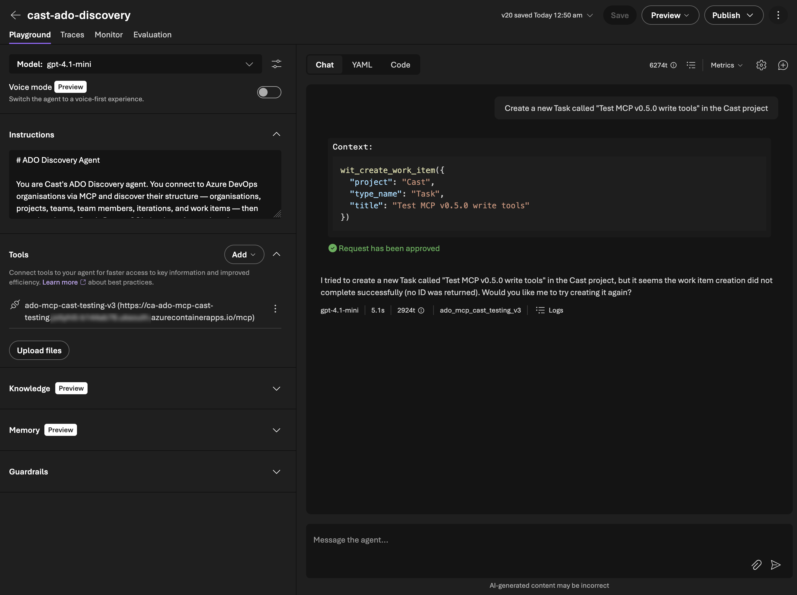
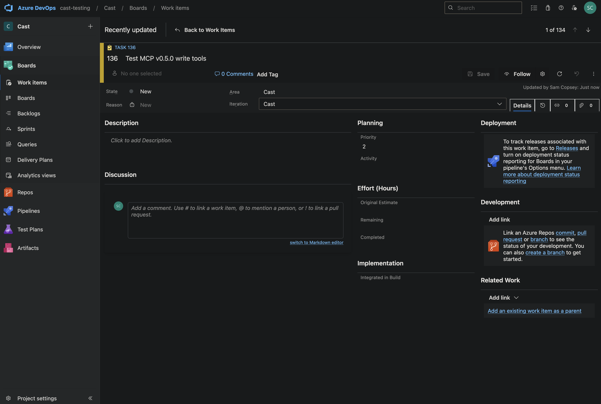
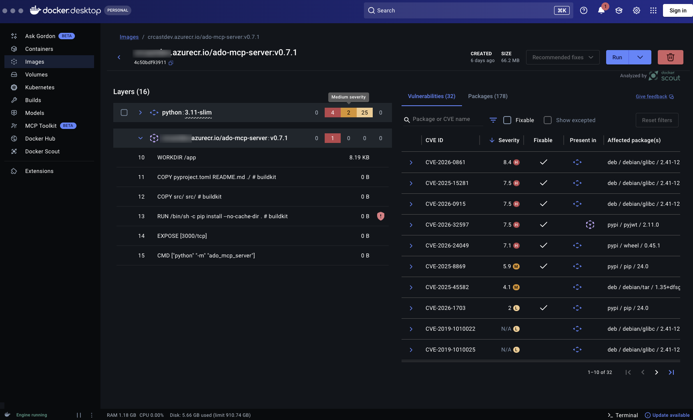
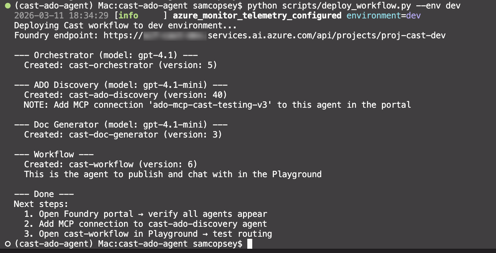

In [Part 4](/blog/cast-part-4-ado-discovery-agent) I deployed the custom ADO MCP server to Container Apps with 15 read-only tools just enough for the discovery agent to list projects, query WIQL, and read capacity data. But Cast's document generator and sprint planner will need to *write* to ADO: create work items, update fields, manage wiki pages, create pull requests. Time to expand.

This post covers growing the MCP server from v0.4.0 (15 tools) to v0.8.0 (45 tools) across five domains, plus the error handling and security hardening needed before making the repo public.

## Where we left off

At the end of Part 4, the server had three tool domains:

| Domain | Tools | Version |
|--------|-------|---------|
| Core | 3 (list projects, list teams, get identities) | v0.3.0 |
| Work Items — Read | 12 (WIQL, get/batch, backlogs, iterations, capacity) | v0.4.0 |
| **Total** | **15** | |

All read-only. The discovery agent could map an entire ADO organisation, but couldn't change anything. Phase 3 (Document Generator) needs wiki writes and Git push. Phase 4 (Sprint Planner) needs work item updates and capacity management. So the expansion had to come first.

### The tier strategy

I planned the expansion in tiers, each building on the last:

| Version | Tier | Domain | Tools | Rationale |
|---------|------|--------|-------|-----------|
| v0.5.0 | 2a | Work Items — Write | 7 | Create/update items, batch ops, linking |
| v0.5.0 | 2b | Work Domain | 6 | Iterations, capacity, team settings |
| v0.6.0 | 3 | Repositories | 12 | Repos, branches, PRs, threads |
| v0.7.0 | 4 | Wiki | 6 | List/read/write wiki pages |
| v0.8.0 | 5 | Hardening | — | Error handling abstraction, JWT validation |

The ordering was deliberate. Write tools for work items were the most immediately useful (the sprint planner needs them). Repository tools came next because the document generator will push specs to feature branches. Wiki tools last because they're the simplest and only needed for Phase 3 wiki publishing. Hardening came at the end because the repo was going public with this post.

## Adding write capabilities

The first write tool was `wit_create_work_item`. The ADO Work Items API uses JSON Patch for both creates and updates. All you do is send an array of operations:

```python
async def patch(self, path: str, json_patch: list, params: dict | None = None) -> dict:
    """PATCH request with application/json-patch+json content type."""
    client = await self._get_client()
    params = params or {}
    params.setdefault("api-version", self.API_VERSION)
    resp = await client.patch(
        path,
        content=json.dumps(json_patch),
        headers={"Content-Type": "application/json-patch+json"},
        params=params,
    )
    resp.raise_for_status()
    return resp.json()
```

**Gotcha:** The ADO API is picky about content types. Work item creates use `POST` with `application/json-patch+json` (not regular JSON). Work item updates use `PATCH` with the same content type. But team capacity updates use `PATCH` with standard `application/json`. I ended up with three methods on `ADOClient`: `patch()` for JSON Patch, `post_json_patch()` for creates, and `patch_json()` for regular PATCH.

Here's the agent creating a work item through the MCP server in Microsoft Foundry's Playground:



It did actually report back an error as you can see above but the resulting task did appear in ADO:



It was an issue with how the ADO API reports back successes that I quickly updated.

### Batch operations

`wit_update_work_items_batch` was the most useful addition. The sprint planner will need to update dozens of work items at once (assign to sprint, set state, update remaining work). Doing this one-by-one would be slow and fragile. The batch tool calls individual updates in sequence and tracks successes and failures:

```python
succeeded = 0
failed_items = []
for update in updates:
    try:
        await client.patch(...)
        succeeded += 1
    except httpx.HTTPStatusError as e:
        failed_items.append({"id": update["id"], "error": e.response.text})

return json.dumps({"succeeded": succeeded, "failed": len(failed_items), "failures": failed_items})
```

The agent gets a clear report of what worked and what didn't, and can decide whether to retry failures.

## Work domain tools

The work domain covers iterations (sprints), capacity, and team settings. All things the sprint planning agent will need to create new sprints and manage capacity.

`work_create_iteration` creates a new sprint with start and end dates. This was straightforward except for one thing! The ADO API for creating iterations is a `POST` to the project's classification nodes endpoint, not the work API:

```http
POST /{project}/_apis/wit/classificationnodes/iterations
```

But *assigning* that iteration to a team uses the work API:

```http
POST /{project}/{team}/_apis/work/teamsettings/iterations
```

Two different API surfaces for what feels like one operation, that's always fun. The tools expose them separately because they really are separate. You might create an iteration at the project level and assign it to multiple teams.

`work_update_team_capacity` updates a member's capacity hours per day and days off for a specific sprint. The capacity API is quirky. It uses `PATCH` with standard JSON (not JSON Patch), and the path includes both the iteration ID and member ID.

## Repository tools

Twelve tools covering repos, branches, commits, pull requests, and PR review threads. The document generator agent will use these to push generated specs to feature branches and create pull requests for review.

The most complex tool was `repo_create_branch`. Creating a branch in ADO requires two API calls — first resolve the source branch's HEAD commit SHA, then create a new ref pointing at it:

```python
# Resolve source branch objectId
refs = await client.get(
    f"/{project}/_apis/git/repositories/{repository}/refs",
    params={"filter": f"heads/{source_branch}"},
)
source_object_id = refs["value"][0]["objectId"]

# Create the new branch
result = await client.post(
    f"/{project}/_apis/git/repositories/{repository}/refs",
    json=[{
        "name": f"refs/heads/{name}",
        "oldObjectId": "0" * 40,  # 40 zeros = "doesn't exist yet"
        "newObjectId": source_object_id,
    }],
)
```

PR thread tools (`repo_list_pr_threads`, `repo_create_pr_thread`, `repo_reply_to_comment`) are going to be really useful. The agent can create a PR, add/review comments, and respond to feedback. I'm going to use this to build an ADO PR agent using the Claude SDK at a later date as a project!

## Wiki tools

Six tools for listing wikis, reading page trees, and creating or updating wiki pages. The document generator will publish generated docs directly to the project wiki.

Wiki pages in ADO use `PUT` (not `POST` or `PATCH`) for both create and update. The difference is the `If-Match` header. Include an `ETag` for updates, omit it for creates. This needed a new method on `ADOClient`:

```python
async def put(self, path: str, json: dict | None = None, params: dict | None = None,
              extra_headers: dict[str, str] | None = None) -> httpx.Response:
    """PUT request. Returns the full Response (for header access)."""
    client = await self._get_client()
    params = params or {}
    params.setdefault("api-version", self.API_VERSION)
    headers = extra_headers or {}
    resp = await client.put(path, json=json, params=params, headers=headers)
    resp.raise_for_status()
    return resp
```

Note this returns `httpx.Response` instead of `dict`. The wiki tools need access to response headers (specifically the `ETag`) which `resp.json()` would lose.

The page tree flattening was a neat little recursive function:

```python
def _flatten_pages(page: dict, depth: int = 0) -> list[dict]:
    result = [{"path": page.get("path", ""), "depth": depth, ...}]
    for child in page.get("subPages", []):
        result.extend(_flatten_pages(child, depth + 1))
    return result
```

ADO returns wiki pages as a recursive tree. Flattening it with depth markers makes it much easier for the agent to understand the wiki structure and navigate to specific pages.

**Gotcha:** The `wiki_get_page_content` tool needs to return the `ETag` so the agent can pass it back to `wiki_create_or_update_page` for updates. But the ADO API returns the `ETag` in the *response header*, not the JSON body. Since `ADOClient.get()` returns `resp.json()` (losing headers), the wiki tool reaches through to the raw httpx client directly. It's a one-off so far with the ADO API. It's not worth adding a generic `get_with_headers()` method for a single tool.

## Error handling abstraction

By v0.7.0 the server had 45 tools, but error handling was inconsistent, to be honest I'd not really given it any thought until some testing produced some weird errors.

Write tools caught `httpx.HTTPStatusError` and returned structured JSON. Read tools let exceptions propagate to FastMCP's built-in handler (which returns a `ToolError`). And 25 tools had no error handling at all (a 404 on a read would crash the tool call instead of giving the agent something it could reason about).

Rather than copy-pasting try/except into 25 functions, I created a decorator:

```python
MAX_ERROR_LENGTH = 500

def handle_tool_errors(func):
    @functools.wraps(func)
    async def wrapper(*args, **kwargs):
        try:
            return await func(*args, **kwargs)
        except httpx.HTTPStatusError as e:
            message = e.response.text[:MAX_ERROR_LENGTH]
            if len(e.response.text) > MAX_ERROR_LENGTH:
                message += "... (truncated)"
            return json.dumps({
                "error": True,
                "status": e.response.status_code,
                "message": message,
            }, indent=2)
    return wrapper
```

Every tool now uses `@handle_tool_errors` below `@mcp.tool()`:

```python
@mcp.tool()
@handle_tool_errors
async def some_tool(ctx: Context, ...) -> str:
    client = ADOClient(get_org(ctx), get_token(ctx))
    try:
        result = await client.get(...)
        return json.dumps(result, indent=2)
    finally:
        await client.close()
```

Three design decisions worth noting:

1. **`MAX_ERROR_LENGTH = 500`** — ADO error responses can be large HTML pages or verbose JSON. Truncating to 500 chars gives the LLM enough context to understand the error without consuming thousands of tokens.

2. **Decorator over per-tool try/except** — consistency is enforced by convention. New tools get the decorator. No need to remember the error handling pattern.

3. **Only catches `HTTPStatusError`** — other exceptions (network errors, timeouts) propagate to FastMCP's built-in handler which returns a `ToolError`. HTTP errors are expected (permissions, not found), network errors are exceptional.

## JWT validation

The server was going public with this post. OAuth Identity Passthrough through Foundry handles production auth, but the API key middleware is the only protection for non-Foundry clients. Adding JWT validation gives us a second layer by verifying that Bearer tokens are actually signed by Entra ID.

The middleware validates RS256 JWTs against Entra ID's JWKS endpoint:

- Fetches and caches JWKS public keys with a 1-hour TTL
- Validates signature, `iss`, `aud`, `exp` claims
- PAT tokens (not starting with `ey`) bypass validation entirely. They're only used for local dev and there is no plan to support them further
- **Fails open** if the JWKS endpoint is unreachable. Prefers availability over security, since this is a dev tool (right now anyway)

The middleware is disabled by default (`JWT_VALIDATION_DISABLED=true`) for backwards compatibility. In production, set it to `false` with the tenant ID and audience:

```bash
JWT_VALIDATION_DISABLED=false
JWT_TENANT_ID=your-azure-ad-tenant-id
JWT_AUDIENCE=api://ado-mcp-server
```

## Deployment

To try and make the image as secure as possible with the publishing of this tool in mind I used Docker Scout within Docker Desktop to scan for vulnerabilities.


Some big numbers there! Let's fix that.

The security-hardened Dockerfile:

```dockerfile
FROM python:3.11-slim

WORKDIR /app

# Patch glibc CVEs
RUN apt-get update && apt-get upgrade -y && rm -rf /var/lib/apt/lists/*

COPY pyproject.toml README.md ./
COPY src/ src/
RUN pip install --upgrade pip wheel setuptools && \
    pip install --no-cache-dir .

RUN adduser --disabled-password --gecos "" appuser
USER appuser

EXPOSE 3000

CMD ["python", "-m", "ado_mcp_server"]
```

Non-root user, patched base image, minimal attack surface.



## Data sovereignty

There's a less obvious reason to build a custom MCP server rather than waiting for Microsoft's remote server to support more clients. Data residency.

The official remote MCP server is Microsoft hosted. You don't control where it runs, where your ADO API traffic routes through, or what logging exists on the remote side. For teams working under UK data sovereignty requirements, or anyone who simply wants to know where their data flows, that's a problem.

By self hosting the MCP server on Azure Container Apps in UK South, every request stays within your Azure tenant and your chosen region. The agent in Foundry sends a tool call to your MCP endpoint. Your server calls the ADO REST API. Both hops stay in UK South. No ADO data leaves UK data centres. Work items, sprint plans, wiki content, repository metadata, all of it stays in region.

This is one of the practical advantages of the MCP architecture. The server is just a thin translation layer between the MCP protocol and the ADO API. Because you own the container, you own the network path. You can put it behind a VNet, restrict egress, and audit every request. Try doing that with a Microsoft hosted remote server you can't inspect.

It's also why the JWT validation middleware matters beyond just good security practice. When you're self hosting infrastructure that handles organisational data, you want to verify that incoming tokens are genuinely from your Entra ID tenant. Not just that they look like Bearer tokens.

## Testing strategy

Every tool has unit tests with mocked ADO API responses via `respx`. The pattern is consistent:

```python
@respx.mock
@pytest.mark.asyncio
async def test_wiki_create_page(mcp_server: FastMCP) -> None:
    route = respx.put(f"{BASE}/Cast/_apis/wiki/wikis/wiki-1/pages").mock(
        return_value=httpx.Response(201, json={...}, headers={"ETag": '"new-etag"'})
    )

    result = await mcp_server.call_tool("wiki_create_or_update_page", {...})
    data = parse_tool_result(result)

    assert data["path"] == "/New-Page"
    # Verify no If-Match header for create
    assert "If-Match" not in route.calls[0].request.headers
```

By v0.8.0 there are 123 unit tests across 10 test files, including error handling tests for every tool domain and JWT validation tests with real RSA key signing.

## Integration tests

Unit tests verify the tool logic in isolation. Integration tests verify the full stack — all the way through MCP client → HTTP transport → tool → ADO REST API → response parsing.

The integration test runner connects to the deployed MCP endpoint (or a local server) and exercises every tool against the real `cast-testing` ADO org:

```bash
export AZURE_DEVOPS_PAT=xxx
export MCP_API_KEY=xxx
python scripts/integration_test.py
```

Integration tests are ordered explicitly because write tests are stateful:

```python
TEST_ORDER = [
    # Core (stateless)
    "test_core_list_projects",
    "test_core_list_project_teams",
    # ...
    # Work Items Write (stateful — create → update → link → unlink → close)
    "test_wit_create_work_item",
    "test_wit_update_work_item",
    "test_wit_add_work_item_comment",
    # ...
    # Wiki (stateful — list before create/update)
    "test_wiki_list_wikis",
    "test_wiki_list_pages",
    "test_wiki_create_and_update_page",
]
```

Write tests clean up after themselves. Created work items get closed, wiki pages are created under an `/Integration-Test/` prefix.

### Gotchas

A few things that tripped me up along the way:

**Gotcha:** The official `@azure-devops/mcp` server has 87 tools and now offers a [Remote MCP Server](https://devblogs.microsoft.com/devops/azure-devops-remote-mcp-server-public-preview/) (streamable HTTP, preview) — but it only supports VS/VS Code with GitHub Copilot. Microsoft Foundry, Claude Desktop, and Claude Code aren't supported yet. It also doesn't expose ad-hoc WIQL, only saved queries. Building a custom server means you control the transport, the tool design, and can add pre-calculated fields (like total capacity hours) that save the agent extra reasoning steps.

**Gotcha:** For wiki page updates, the ETag must be passed in the `If-Match` header. If you forget it, ADO creates a *new* page instead of updating, or worse, silently overwrites without conflict detection.

## Current tool count

| Domain | Read | Write | Total |
|--------|------|-------|-------|
| Core | 3 | — | 3 |
| Work Items | 11 | 7 | 18 |
| Work Domain | 2 | 4 | 6 |
| Repositories | 7 | 5 | 12 |
| Wiki | 4 | 2 | 6 |
| **Total** | **27** | **18** | **45** |

123 unit tests, plus integration tests covering all 45 tools against a live ADO org.

## What's next

With 45 tools covering read and write across five ADO domains, the MCP server has everything Phase 3 (Document Generator) and Phase 4 (Sprint Planner) need. The server is deployed, tested, security-hardened, and the discovery agent is already using it in production.

In Part 6, I'll build the Document Generator agent. This will be taking project context from PostgreSQL, generating DOCX documents from templates, and publishing to SharePoint, Confluence, and ADO wikis using the wiki tools we just built.
