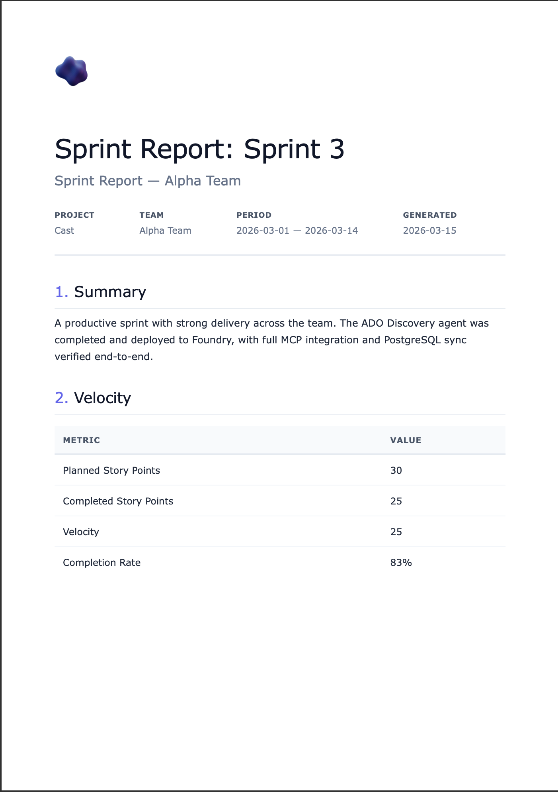
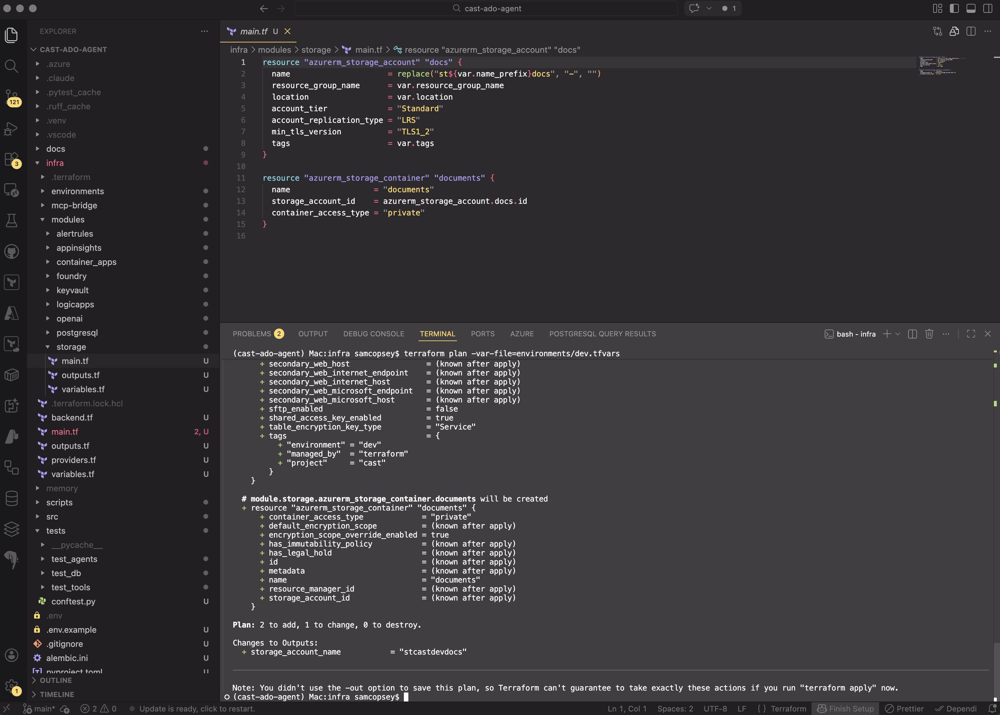
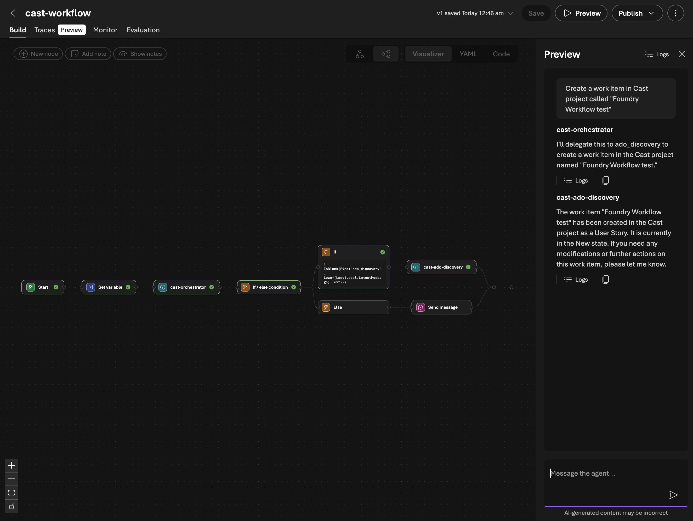
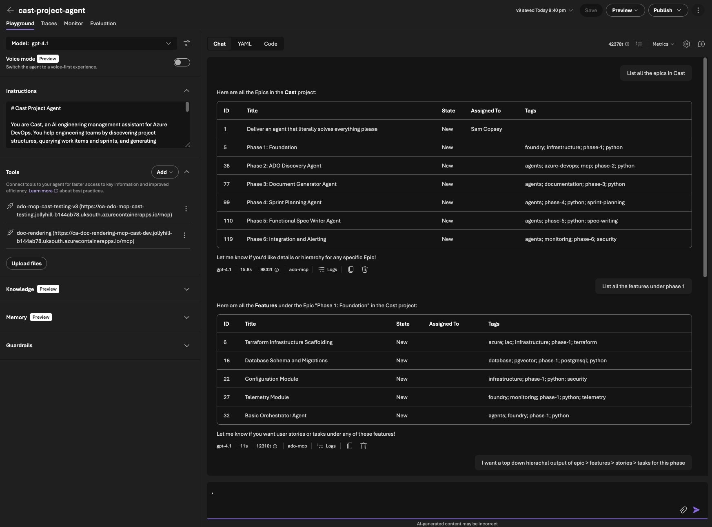
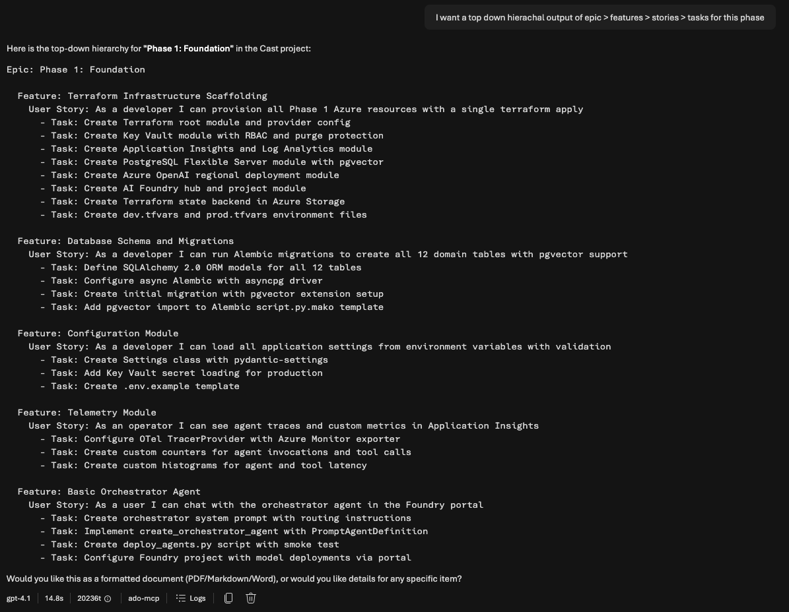

In [Part 5](/blog/cast-part-5-mcp-expansion) I expanded the custom ADO MCP server from 15 tools to 44. With full CRUD across work items, repositories, and wiki pages, the discovery agent can now read and write everything Cast needs. This post covers the next two pieces: a document generator that turns ADO data into polished engineering documents, and an architectural pivot that changed how all of Cast's agents are deployed.

The short version: I built the document generator, integrated it into a Foundry Workflow, discovered the workflow was fundamentally broken for multi-turn conversations, and consolidated everything into a single combined agent. This post walks through the full journey.



## Building the document generator

The Document Generator agent takes project context (sprint data, work items, velocity metrics, team capacity) and renders it into professional documents. Four template types, four output formats, delivered via a time-limited download URL in the chat.

| Template | Formats | Purpose |
|----------|---------|---------|
| Sprint Report | HTML, PDF, Markdown | Sprint velocity and completion summary |
| User Guide | HTML, PDF, DOCX | Step-by-step end-user instructions |
| Use Case | HTML, PDF, Markdown | Structured use case with actors and flows |
| Functional Spec | HTML, PDF, DOCX | Detailed functional specification |

The agent doesn't just dump raw text. It renders clean, paginated PDFs with headers and footers, editable DOCX files with professional formatting, and HTML with a nice aesthetic.

### The template registry

Rather than hardcoding template logic, I built a YAML-driven registry. Each template declares its metadata, supported formats, required fields, and optional fields:

```yaml
# src/templates/registry.yaml
templates:
  sprint_report:
    display_name: Sprint Report
    description: Sprint velocity and completion summary
    category: reporting
    required_fields:
      - sprint_name
      - team_name
      - project_name
      - start_date
      - end_date
      - planned_points
      - completed_points
      - velocity
    optional_fields:
      - work_items
      - retrospective_notes
      - highlights
    formats:
      html:
        template: sprint_report.html
        css: whitepaper.css
      pdf:
        template: sprint_report.html
        css: whitepaper.css
      markdown:
        template: sprint_report.md
```

The registry loads via Pydantic models and is cached with `@functools.lru_cache`. Adding a new template means adding a YAML entry, an HTML template, and optionally a DOCX template. No Python code changes.

The agent's first tool, `list_templates`, reads the registry and returns the full metadata. This means the LLM knows what templates exist, what formats they support, and what fields they need. All without hardcoded prompt instructions that drift from reality.

### The rendering engine

Document rendering lives in `src/tools/doc_tools.py` with four render functions:

**HTML** uses Jinja2 templates with a shared CSS stylesheet. The whitepaper aesthetic uses clean typography, subtle borders, and a professional colour palette. Templates extend a base layout that includes the CSS inline (important for PDF conversion and email compatibility).

```python
async def render_html(template_name: str, context: dict) -> str:
    registry = load_template_registry()
    entry = registry.templates[template_name]
    format_entry = entry.formats["html"]

    env = Environment(loader=FileSystemLoader(TEMPLATES_DIR))
    template = env.get_template(format_entry.template)

    css = ""
    if format_entry.css:
        css = (TEMPLATES_DIR / format_entry.css).read_text()

    return template.render(**context, css=css)
```

**PDF** renders HTML first, then converts to paginated PDF via [WeasyPrint](https://weasyprint.org/). One template serves both HTML preview and PDF output. WeasyPrint handles page breaks, headers, footers, and page numbers via CSS `@page` rules.

I've used [Playwright](https://playwright.dev/) for PDF generation in other projects and it's excellent for complex layouts that need full browser rendering. For this MCP server though, WeasyPrint was the better fit. The doc-rendering server runs on Container Apps where cold start time and image size matter. Playwright needs a Chromium binary which adds 250MB+ to the Docker image and takes seconds to launch a headless browser on each request. WeasyPrint is a Python library with a handful of system dependencies (pango, cairo) that adds maybe 30MB and renders directly from HTML without a browser process. The templates here are clean whitepaper layouts, not complex interactive pages, so full browser rendering is overkill. WeasyPrint also has native `@page` CSS support for headers, footers, and page numbering which Playwright's "print to PDF" approach handles less cleanly. The trade-off is that WeasyPrint can't execute JavaScript or render anything that depends on browser APIs, but that's not relevant for document templates.

Note that WeasyPrint requires those system dependencies (pango, gobject-introspection) that aren't trivially available everywhere. I skip PDF tests locally when WeasyPrint isn't installed rather than making it a hard requirement.

**DOCX** uses [docxtpl](https://docxtpl.readthedocs.io/) with corporate-formatted Word templates. These are real `.docx` files with Jinja2 tags inside. The advantage is that document styling (fonts, spacing, headers) is controlled by the template designer in Word, not in code.

**Markdown** uses Jinja2 templates rendering to Markdown with YAML frontmatter. These are designed for ADO Wiki publishing via the MCP `wiki_create_or_update_page` tool.

### Document delivery: Blob Storage with SAS URLs

Here's the problem I hit: `_render_document()` renders a PDF to a temp file and returns the path. That works locally, but in the Foundry-managed runtime there's no filesystem the user can access. The agent needs to hand the user a clickable download link.

The solution: Azure Blob Storage with time-limited SAS URLs.



A new Terraform module provisions a storage account and a private container:

```hcl
resource "azurerm_storage_account" "docs" {
  name                     = replace("st${var.name_prefix}docs", "-", "")
  resource_group_name      = var.resource_group_name
  location                 = var.location
  account_tier             = "Standard"
  account_replication_type = "LRS"
  min_tls_version          = "TLS1_2"
  tags                     = var.tags
}

resource "azurerm_storage_container" "documents" {
  name                  = "documents"
  storage_account_id    = azurerm_storage_account.docs.id
  container_access_type = "private"
}
```

The container is private. All access goes through SAS tokens. The key design choice: **user delegation keys** instead of storage account keys. This means authentication flows through `DefaultAzureCredential` (managed identity in prod, `az login` in dev). No storage key in config or Key Vault.

PDF and DOCX renders automatically upload to blob storage and return a download URL instead of a local file path:

```python
result = await upload_blob(str(output_path), content_type="application/pdf", doc_type=template_name)
return {"format": "pdf", "download_url": result["url"], "expires_at": result["expires_at"]}
```

HTML and Markdown continue returning content as text for inline display. If blob storage isn't configured (e.g. local development), the render gracefully falls back to returning the local file path. No crash, no error.

## Integrating with Foundry Workflows

### Workflow chaining

The Foundry Workflow chains the discovery agent before the document generator. When a user says "Generate a sprint report for Sprint 3", the workflow routes to the orchestrator, invokes the discovery agent to gather sprint data, then passes that context to the doc generator which renders the document and returns the download URL.



The prompt pattern I settled on is **"data first, questions second"**. The doc generator's system prompt tells it to extract everything it can from the provided ADO context before asking the user anything. It only asks about subjective content: what to highlight, retrospective commentary, document tone. This keeps the conversation tight.

The workflow used Power Fx expressions to pass context between agents, but the CSDL YAML parser had some quirks. Nested expressions that looked valid would silently break the workflow visualiser with no error or warning. Keeping expressions flat solved it.

### The hallucination trap: when agents fabricate data

The full pipeline was deployed: orchestrator routes to discovery, discovery gathers ADO data, doc generator renders the report. I typed "generate a sprint report for the current iteration in the Cast project" and got back a beautifully formatted sprint report for **Sprint 11** with team members Alice, Bob, and Charlie, work items 101 through 103, all with plausible-looking story points and completion rates.

None of it was real. The actual current sprint was `IntTest-1773229671`. The MCP server logs confirmed: zero ADO API calls during that request. The discovery agent's OAuth token had expired (it last authenticated 3 hours earlier), so when the workflow invoked it, it had no working tools. Rather than returning an error, it fabricated an entire sprint dataset.

This is the most dangerous kind of hallucination because it *looks* right. The JSON structure was correct. The field names matched the schema. The numbers were plausible. If you weren't staring at the real ADO board, you'd accept it.

The fix has two parts. First, explicit anti-hallucination rules in the discovery agent's system prompt telling it to never fabricate data and to return a structured error if tools are unavailable. Second, OAuth session management awareness: the Foundry Workflow can't trigger the MCP OAuth consent flow, so the user must pre-authorise by chatting directly with the discovery agent first. When the token expires, the workflow silently fails. The anti-hallucination prompt converts that silent failure into an explicit error the user can act on.

This incident also exposed a deeper problem. The `FunctionTools` pattern worked in the code-first path, but the Foundry Workflow path deployed agents via `PromptAgentDefinition` which has no Python runtime. The doc generator's render and upload tools simply didn't exist in Foundry. So I extracted all rendering and blob delivery into a standalone MCP server (`doc-rendering-mcp-server`): FastMCP, Starlette, Streamable HTTP, deployed on Container Apps. Six tools, templates bundled in the Docker image. Binary formats upload to Blob Storage via Managed Identity and return SAS URLs. Text formats return content directly.

But fixing the rendering deployment didn't fix the fundamental workflow problems.

## The architectural pivot

### Why the workflow had to go

Three problems all pointed to the same conclusion.

**Problem 1: Foundry Workflows are single-turn only.** Every user message restarts the workflow from scratch. When the doc generator asks "What format would you like?" and the user replies "PDF", that reply enters the workflow as a brand new request. The orchestrator re-classifies it, can't match any routing keyword, and the conversation context is gone. I tried workarounds: sticky routing, state variables, routing everything through the orchestrator. None of them are real solutions. They're patches around a fundamental platform limitation.

**Problem 2: Model scaling.** My discovery agent ran on gpt-4.1-mini with 44 ADO MCP tools. When I added the doc rendering MCP server's 6 tools, the total hit 50. At that point, gpt-4.1-mini started hallucinating tool calls: calling tools that don't exist, passing wrong parameter schemas, mixing up tool names between the ADO and doc-rendering servers. This isn't a prompt engineering problem. It's a context window and attention issue. gpt-4.1, however, handles 55 tools reliably. The cost difference is significant (roughly 5x per token), but a single agent that works is cheaper than a multi-agent workflow that produces garbage.

**Problem 3: The dual-prompt problem.** The discovery agent's prompt described all its capabilities including database function tools. But in the Foundry path, it only had MCP tools. The prompt said "query the database to find teams" but the agent had no database tool. So it asked the user instead. Every time. I ended up maintaining two separate prompts for the same agent, one per deployment path. This is an architectural smell.

| Approach | Model | Tools | Multi-turn | Reliability |
|----------|-------|-------|------------|-------------|
| Workflow + 2 agents | gpt-4.1-mini | 44 + 6 (split) | Broken | Hallucinations at 50 tools |
| Combined agent | gpt-4.1 | 50+ (single agent) | Works | Reliable tool selection |

### The combined agent as a development strategy

The Foundry Workflow problems needed a solution, but the goal was never to settle on a single monolithic agent as the production architecture. The production system will use a custom React UI backed by the code-first multi-agent design: Agent Framework with `as_tool()` delegation, specialist agents for each capability, and an orchestrator that routes via tool-calling. That architecture doesn't change.

What I needed was a way to keep building and testing new capabilities (document generation now, sprint planning next) without fighting workflow YAML for every iteration. The combined Foundry agent solves that. One agent, one prompt, one conversation thread in Foundry Playground. It's a development and testing harness that lets me validate MCP tools, prompts, and end-to-end flows quickly. Each specialist agent still exists in the codebase ready for the code-first path.

The combined approach does have known limitations I'm accepting for now. Cramming 50+ tools into a single gpt-4.1 agent will hit TPM rate limits under real usage, and a single prompt covering all capabilities will become unwieldy as more features land. These are problems for the production multi-agent architecture to solve, not problems to fix in the test harness.





The combined prompt (`src/prompts/project_agent.md`) merges all capabilities into a single document with clear boundaries. Each capability has its own workflow section with numbered steps. For sprint reports: look up the project, find the team, find the iteration, query work items, get capacity, build the context, render via MCP. This level of specificity matters. Without it, the model improvises, and when improvising with 50+ tools, it tends to call the wrong tool or skip steps.

```
Development/testing (Foundry Playground)
  └── cast-project-agent (PromptAgentDefinition + MCPTool)
        └── MCP: ADO + doc-rendering

Production target (React UI + Agent Framework)
  └── Orchestrator (Agent + FunctionTool)
        ├── ADO Discovery (Agent.as_tool())
        ├── Doc Generator (Agent.as_tool())
        └── Sprint Planner (Agent.as_tool())
```

Both paths use the same MCP servers, so every tool I build and test in the Foundry agent is directly reusable when the production UI comes online.

### SDK MCPTool: MCP connections in code

The second change was defining MCP connections via the SDK instead of the portal. Previously, adding an MCP connection meant navigating the Foundry portal, manually configuring OAuth, remembering the connection name, and hoping it didn't break on redeploy.

With `MCPTool` from `azure.ai.projects.models`, MCP connections live in code:

```python
from azure.ai.projects.models import MCPTool, PromptAgentDefinition

# ADO MCP — OAuth Identity Passthrough for per-user permissions
ado_tool = MCPTool(
    server_label="ado-mcp",
    server_url=settings.ado_mcp_endpoint + "/mcp",
    require_approval="never",
    project_connection_id="ado-mcp-cast-testing-v3",
)

# Doc rendering MCP — no auth (internal Container App)
doc_tool = MCPTool(
    server_label="doc-rendering",
    server_url=settings.doc_rendering_mcp_endpoint,
    require_approval="never",
)
```

The `project_connection_id` references a Foundry MCP connection name. The OAuth app registration still needs to be created once in the portal (Foundry generates the redirect URI). But once that exists, the agent configuration is fully code-driven.

The combined agent deploys via a single script. `create_version()` creates a new immutable version of the agent. The Foundry portal shows version history and lets you roll back. Each deploy increments the version number.

**Gotcha:** In March 2026, the Foundry API started returning responses with `Content-Encoding: br` (Brotli compression). The `azure-core` HTTP pipeline doesn't decompress Brotli, so API calls return garbled bytes. Fix: add `HeadersPolicy(headers={"Accept-Encoding": "gzip, deflate"})` as `per_call_policies` on the `AIProjectClient` to opt out of Brotli.

### Anti-hallucination prompt design

The hallucination trap from earlier taught a clear lesson: if your agent has tools described in its prompt but those tools are unavailable at runtime (expired auth, network errors, misconfigured connections), the LLM will fill in the gaps with fabricated data.

The most critical section of the combined prompt:

```markdown
## Critical Rule: Always Use Tools

**You MUST call MCP tools to get data. You have ZERO knowledge about
any ADO project, sprint, team, or work item.**

If you respond with project names, sprint names, work items, team members,
dates, or any factual data WITHOUT having called an MCP tool that returned
that data, you are hallucinating.
```

This rule forces the agent to either call a tool or report an error. Never fill in gaps from training data. The discovery agent also returns a structured error format so downstream agents (like the doc generator) know data gathering failed and can tell the user instead of rendering a report full of fiction.

Prompt-level guardrails help, but they're not foolproof. The real defence is checking the tool call logs. If your agent returns data, you need to verify that data actually came from a tool call.

### Trade-offs of the combined approach

The combined agent is a deliberate choice for the development phase, and the trade-offs reflect that.

**Cost.** gpt-4.1 is roughly 5x more expensive than gpt-4.1-mini per token. For simple queries like "list projects", a mini-model agent would be cheaper. The production multi-agent system will route simple requests to cheaper models. For now, the reliability gain means fewer retries and no hallucinated reports.

**TPM rate limits.** A single agent making all tool calls sequentially will hit token-per-minute limits faster than specialist agents running in parallel. This is a known constraint I'm accepting in the test environment. The production architecture splits the load across agents with their own rate limit budgets.

**Prompt size.** The combined prompt is ~160 lines and growing. It's manageable today but won't scale indefinitely. The code-first path retains full separation with focused prompts per specialist.

**What this gives me now:** multi-turn conversations work, which is essential for document generation. I can iterate on new capabilities without deploying workflows. And every MCP tool I validate in Foundry Playground transfers directly to the production system.

## Testing and deployment

### Testing the combined agent

<video src="/videos/cast-part-6/full-pipeline-demo.mp4" autoplay loop muted playsinline></video>
<span class="video-caption">Full pipeline: sprint report request, MCP tool calls, PDF download, then multi-turn Markdown re-render</span>

After deploying the combined agent, I ran the full test matrix in Foundry Playground:

- "List all projects" correctly called `core_list_projects` and returned the Cast project
- "Show current sprint for Cast" called `core_list_teams` then `work_get_team_iterations`, matching today's date to the active iteration
- "Generate a sprint report for Sprint 1 as PDF" ran the full pipeline: project lookup, team lookup, iteration lookup, WIQL query for work items, capacity query, template rendering via doc-rendering MCP, and returned a SAS download URL
- "Actually, make that Markdown instead" proved multi-turn works. It picked up the sprint context from the previous messages and re-rendered as Markdown

The multi-turn test was the critical one. In the old workflow, that "make that Markdown instead" message would have restarted the entire flow and either failed routing or re-queried all the ADO data unnecessarily.

Both repos pass `ruff check` clean, with 23 tests in the Cast repo and 24 in the doc-rendering MCP server repo covering agent creation, template rendering, blob upload, and error handling.

### What's deployed

| Component | Version | What changed |
|-----------|---------|-------------|
| cast-project-agent | v9 | Combined ADO + doc gen + sprint planning |
| doc-rendering-mcp-server | v0.3.0 | 6 MCP tools, templates bundled |
| Azure Storage | — | `documents` container, private with SAS URLs |
| cast-workflow | — | Superseded (not deployed) |

The user experience in Foundry Playground: type "Generate a sprint report for Sprint 1 as PDF", the agent gathers data via MCP, renders via the doc-rendering MCP server, uploads to blob storage, and returns a clickable SAS URL that expires in 1 hour.

## What's next

Part 7 adds sprint planning to the combined agent: capacity analysis, work item hierarchy building from natural language specs, AI-driven time estimation calibrated against historical ADO data using pgvector similarity search, and human-in-the-loop approval before writing anything back to ADO.
