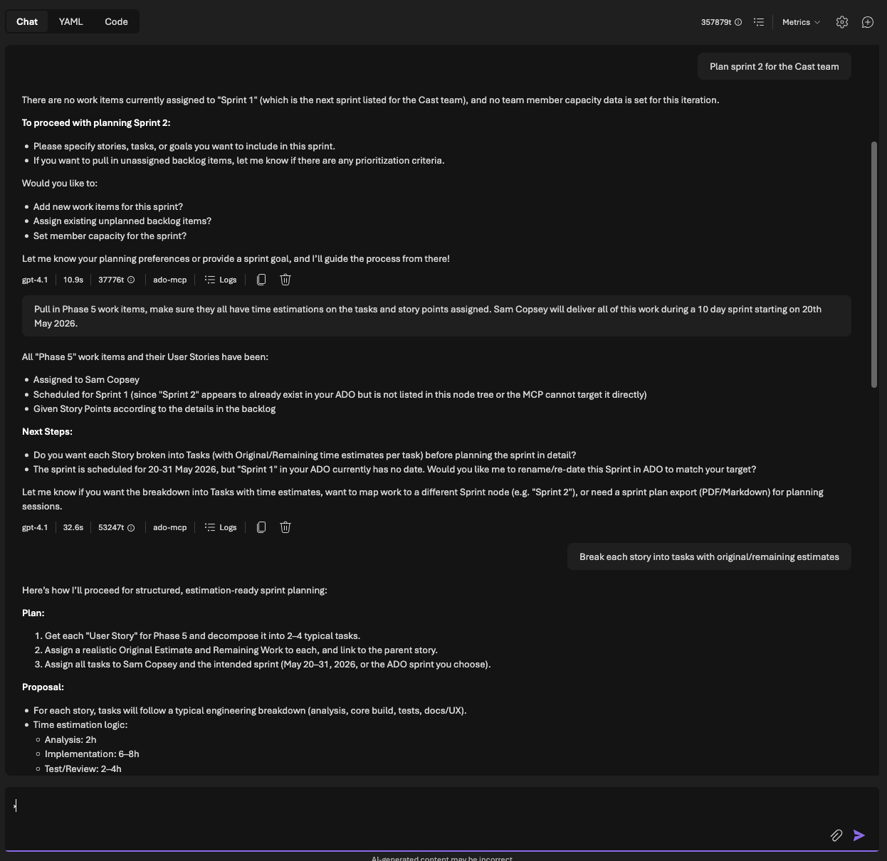
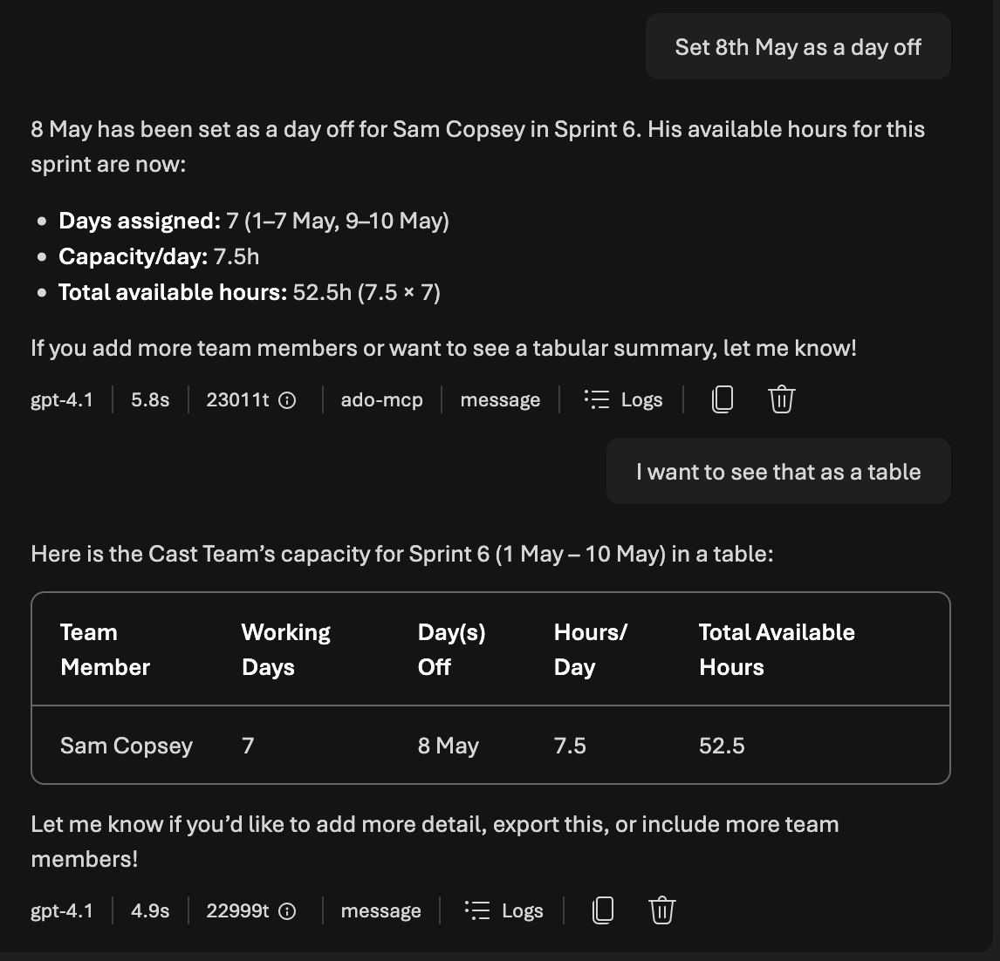
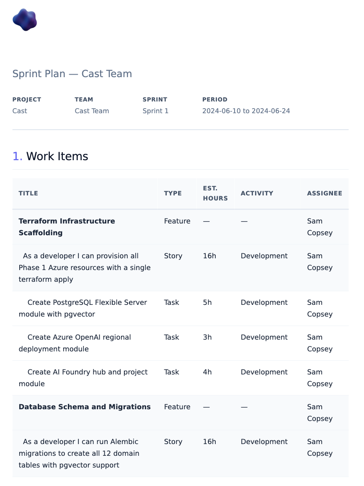
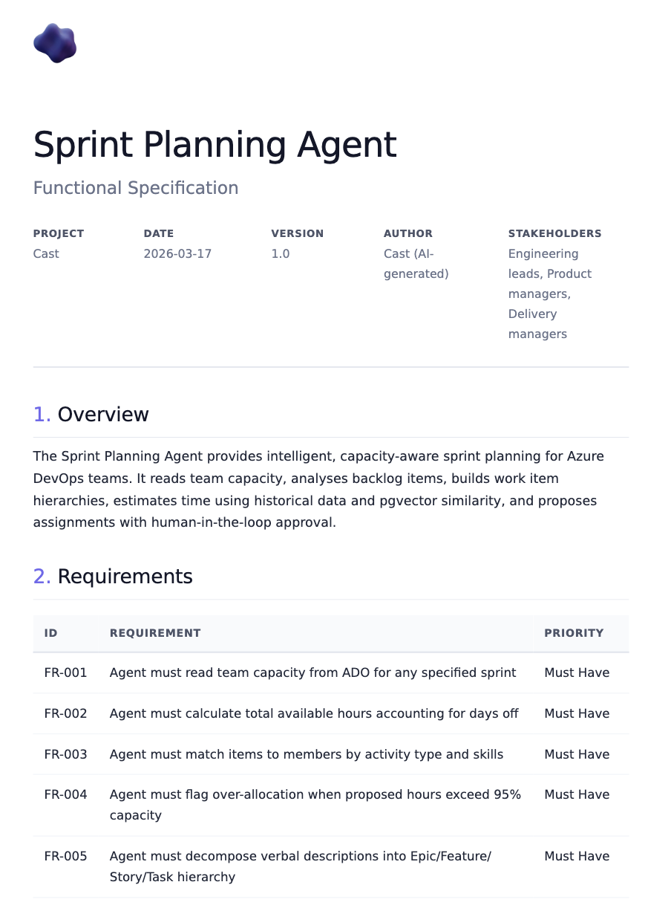
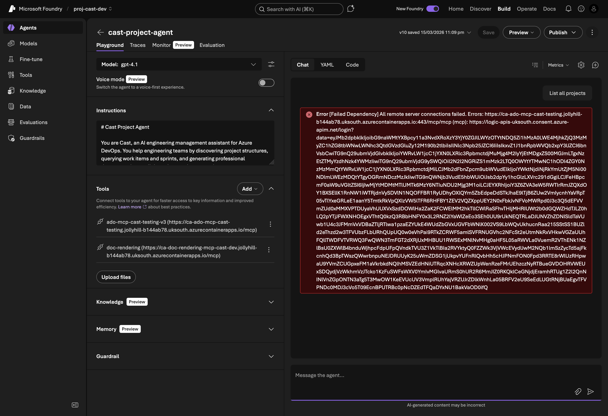
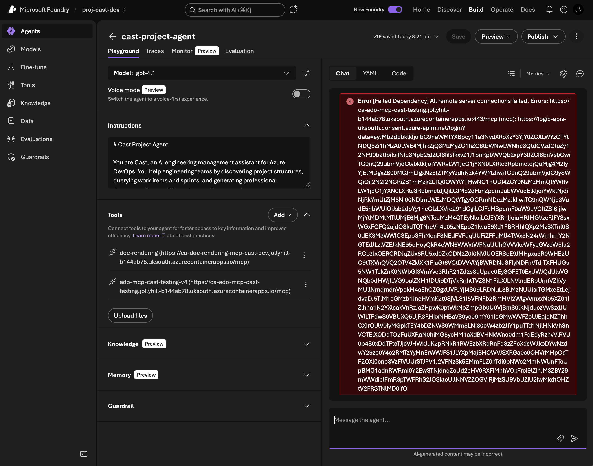
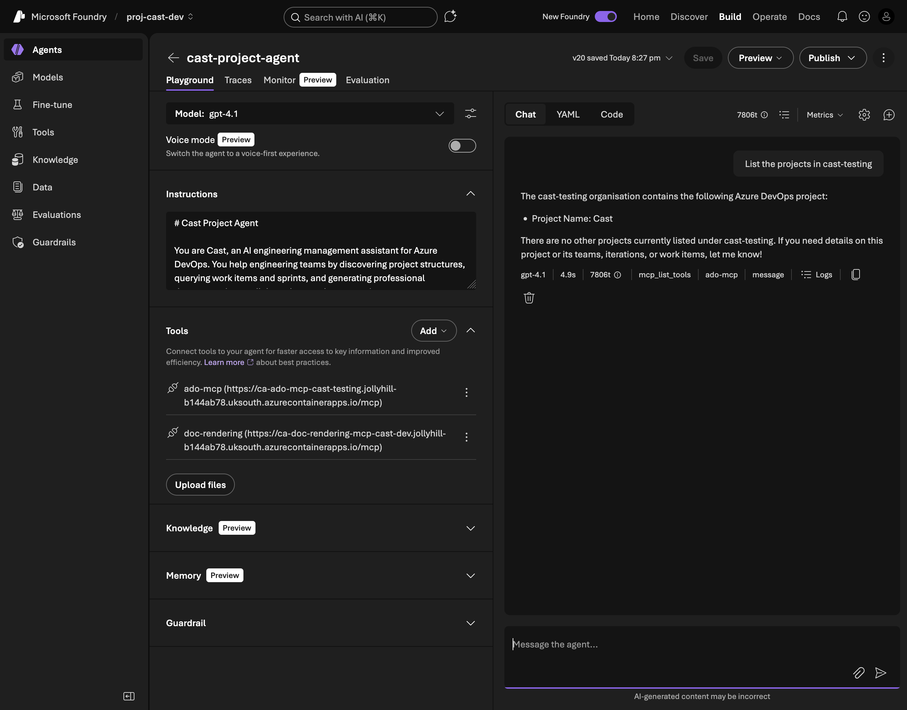

<video src="/videos/cast-part-7/sprint-planning-demo.mp4" autoplay loop muted playsinline></video>
<span class="video-caption">Live interaction: the Cast agent planning a sprint with capacity calculation and human approval</span>

In [Part 6](/blog/cast-part-6-document-generator) I consolidated Cast from a multi-agent Foundry Workflow into a single combined agent with 50+ MCP tools. That agent can discover ADO data and generate professional documents. Now it needs to actually *plan work* and *write specifications*, the two capabilities that justify the whole system.

This post covers three things: a sprint planning agent that calculates capacity in hours, proposes assignments, and refuses to touch ADO until a human says "approve"; a functional spec writer that follows a strict 10-section template and generates ROI questions instead of fabricating numbers; and a debugging war story about Foundry's OAuth consent service breaking between Sunday and Thursday with no code changes on my side.

## Sprint planning: the capacity problem

Sprint planning is the hardest thing I've asked Cast to do. It's multi-turn (the agent proposes, the human reviews, the agent writes). It involves real maths (capacity hours, utilisation percentages, over-allocation detection). And the stakes are higher because writing incorrect assignments to ADO wastes an entire team's sprint.

The critical rule, stated at the top of every sprint planning prompt:

> **Never write changes to ADO without explicit user approval.** Always present the plan as a proposal first.



The data flow looks like this:

1. ADO MCP tools fetch capacity, iterations, and backlog items
2. The agent calculates available hours per team member
3. It matches items to members by activity type, skills, and remaining capacity
4. It presents two tables: capacity summary and assignment proposal
5. The human reviews and says "approve" (or doesn't)
6. Only then does the agent write to ADO

### Capacity calculation

ADO stores capacity as hours-per-day per team member per activity. To get total available hours for a sprint, you need the iteration dates, the number of working days, and each member's days off. Here's the core calculation from `src/tools/ado_tools.py`:

```python
async def get_team_capacity(
    org_url: str,
    project: str,
    team: str,
    iteration_id: str,
    access_token: str,
) -> list[TeamCapacity]:
    """Fetch team capacity for a sprint iteration."""
    # Fetch capacity and iteration dates in parallel
    cap_url = (
        f"{org_url}/{project}/{team}/_apis/work/teamsettings"
        f"/iterations/{iteration_id}/capacities?api-version=7.1"
    )
    iter_url = (
        f"{org_url}/{project}/{team}/_apis/work/teamsettings"
        f"/iterations/{iteration_id}?api-version=7.1"
    )

    headers = {"Authorization": f"Bearer {access_token}"}

    async with httpx.AsyncClient(timeout=30.0) as client:
        cap_response = await client.get(cap_url, headers=headers)
        cap_response.raise_for_status()
        cap_data = cap_response.json()

        iter_response = await client.get(iter_url, headers=headers)
        iter_response.raise_for_status()
        iter_data = iter_response.json()

    # Calculate working days in the sprint
    attrs = iter_data.get("attributes", {})
    working_days = _count_working_days(
        attrs.get("startDate", ""), attrs.get("finishDate", "")
    )

    capacities: list[TeamCapacity] = []
    for entry in cap_data.get("value", []):
        member = entry.get("teamMember", {}).get("displayName", "Unknown")
        days_off = len(entry.get("daysOff", []))
        effective_days = max(0, working_days - days_off)

        for activity in entry.get("activities", []):
            cap_per_day = activity.get("capacityPerDay", 0)
            capacities.append(
                TeamCapacity(
                    team_member=member,
                    activity=activity.get("name", ""),
                    capacity_per_day=cap_per_day,
                    days_off=days_off,
                    total_available_hours=cap_per_day * effective_days,
                )
            )
    return capacities
```

The `_count_working_days` helper does the obvious thing: it counts weekdays (Monday to Friday) between two dates, inclusive.

```python
def _count_working_days(start_str: str, end_str: str) -> int:
    """Count weekday working days between two ISO date strings."""
    if not start_str or not end_str:
        return 10  # Default 2-week sprint assumption

    try:
        start = datetime.date.fromisoformat(start_str[:10])
        end = datetime.date.fromisoformat(end_str[:10])
    except ValueError:
        return 10

    count = 0
    current = start
    while current <= end:
        if current.weekday() < 5:  # Mon=0 ... Fri=4
            count += 1
        current += datetime.timedelta(days=1)
    return count
```



The formula is: `total_available_hours = capacity_per_day × (working_days - days_off)`. For a 2-week sprint (10 working days) with Alice at 6h/day Development and 0 days off, that's 60 available hours. Bob at 4h/day Testing with 2 days off gets 32 hours.

### Persisting capacity snapshots

Once the agent fetches capacity from ADO, it saves a snapshot to PostgreSQL via `save_capacity_snapshot`. This serves two purposes: the sprint plan references persist across conversations, and historical data feeds velocity analysis later.

```python
async def save_capacity_snapshot(
    team_id: int,
    sprint_name: str,
    iteration_path: str,
    start_date: str | None,
    end_date: str | None,
    capacities: list[dict[str, Any]],
) -> dict[str, Any]:
    """Upsert a Sprint row and CapacityEntry rows from ADO capacity data."""
    async with get_session() as session:
        # Upsert sprint
        stmt = pg_insert(Sprint).values(
            team_id=team_id,
            name=sprint_name,
            iteration_path=iteration_path,
            start_date=dt.date.fromisoformat(start_date) if start_date else None,
            end_date=dt.date.fromisoformat(end_date) if end_date else None,
        )
        stmt = stmt.on_conflict_do_update(
            constraint="uq_sprint_team_iteration",
            set_={
                "name": stmt.excluded.name,
                "start_date": stmt.excluded.start_date,
                "end_date": stmt.excluded.end_date,
            },
        )
        await session.execute(stmt)

        # Get the sprint ID, then upsert capacity entries
        sprint = await session.execute(
            select(Sprint)
            .where(Sprint.team_id == team_id)
            .where(Sprint.iteration_path == iteration_path)
        )
        sprint = sprint.scalar_one()

        for cap in capacities:
            cap_stmt = pg_insert(CapacityEntry).values(
                sprint_id=sprint.id,
                member_id=cap["member_id"],
                activity=cap["activity"],
                capacity_hours_per_day=cap["capacity_hours_per_day"],
                days_off=cap.get("days_off", 0),
            )
            cap_stmt = cap_stmt.on_conflict_do_update(
                constraint="uq_capacity_sprint_member_activity",
                set_={
                    "capacity_hours_per_day": cap_stmt.excluded.capacity_hours_per_day,
                    "days_off": cap_stmt.excluded.days_off,
                },
            )
            await session.execute(cap_stmt)

    return {"sprint_id": sprint.id, "capacity_entries_count": len(capacities)}
```

The `on_conflict_do_update` pattern (PostgreSQL upsert) means the agent can re-fetch capacity without creating duplicates. This matters because users will ask "show me capacity" multiple times during a planning session.

### Iteration management: a hidden complexity

Before the agent can assign work items to a sprint, it needs to ensure the iteration actually exists and is assigned to the team. ADO has two levels of iteration: project-level iterations (classification nodes in Project Settings) and team-level iterations (assigned to a team's backlog). An iteration can exist at the project level but not appear on a team's sprint board.

This caught me out during testing. The agent would try to set `System.IterationPath = "Cast\Sprint 7"` on a work item, and ADO would reject it because Sprint 7 wasn't on the team's backlog, even though it existed in the project. The fix was a three-step check in the prompt:

1. `work_list_iterations` to list all project-level iterations
2. If the iteration doesn't exist: `work_create_iteration` with dates
3. `work_get_team_iterations` to check if it's on the team's backlog. If not: `work_assign_iteration_to_team`

The prompt explicitly warns: "An iteration exists at the project level but doesn't appear on the team's sprint board. This means it exists but hasn't been assigned to the team. Use `work_assign_iteration_to_team`. Do NOT try to create it again." Without this, the agent would attempt to create a duplicate iteration and get a 409 Conflict.

## Work item hierarchy building

The second sprint planning workflow is more creative: the user describes what they want built in natural language, and the agent decomposes it into an ADO-ready hierarchy of Epic > Feature > User Story > Task.

For each task, the agent estimates three fields:

- **Original Estimate** (`Microsoft.VSTS.Scheduling.OriginalEstimate`): total hours expected
- **Remaining Work** (`Microsoft.VSTS.Scheduling.RemainingWork`): hours left (equals Original Estimate for new items)
- **Completed Work** (`Microsoft.VSTS.Scheduling.CompletedWork`): hours done (0 for new items)

### Estimation calibration with pgvector

Raw LLM estimates are unreliable. A model might say "4 hours" for a task that historically took 12. To calibrate, the agent uses `find_similar_work_items`, a pgvector semantic search that finds completed items with similar descriptions and checks their actual time data.

```python
async def find_similar_work_items(
    query_text: str,
    work_item_type: str | None = None,
    top_k: int = 10,
) -> list[dict[str, Any]]:
    """Find similar completed work items using pgvector semantic search."""
    embedding = await embed_text(query_text)

    async with get_session() as session:
        type_filter = ""
        params: dict[str, Any] = {"embedding": str(embedding), "top_k": top_k}
        if work_item_type:
            type_filter = "AND type = :work_item_type"
            params["work_item_type"] = work_item_type

        result = await session.execute(
            text(
                f"""
                SELECT id, ado_work_item_id, type, title, state, assigned_to,
                       story_points, remaining_work, iteration_path, description,
                       1 - (content_embedding <=> :embedding::vector) AS similarity
                FROM work_items
                WHERE content_embedding IS NOT NULL
                  AND state IN ('Closed', 'Done', 'Resolved')
                  {type_filter}
                ORDER BY content_embedding <=> :embedding::vector
                LIMIT :top_k
                """
            ),
            params,
        )
        rows = result.fetchall()

    return [
        {
            "ado_work_item_id": row.ado_work_item_id,
            "type": row.type,
            "title": row.title,
            "story_points": float(row.story_points) if row.story_points else None,
            "remaining_work": float(row.remaining_work) if row.remaining_work else None,
            "similarity": float(row.similarity),
        }
        for row in rows
    ]
```

The key insight: filter to `state IN ('Closed', 'Done', 'Resolved')` because only completed items have meaningful actual-time data. The agent compares their Original Estimate vs Completed Work to understand estimation bias. If historically similar tasks were estimated at 8h but took 12h on average, the agent adjusts its estimates upward and explains why.

Each estimate gets a confidence score:

| Confidence | Score | Meaning |
|-----------|-------|---------|
| High | > 0.8 | Strong vector match with consistent actuals |
| Medium | 0.5 to 0.8 | Reasonable comparison, some variance |
| Low | < 0.5 | No historical data, heuristic-based |

If pgvector returns no results (empty embedding table, no similar items), the agent falls back to complexity-based heuristics and states the confidence level openly. No silent guessing.

### Historical velocity analysis

Before proposing a sprint commitment, the agent checks whether the team can actually deliver it. `get_historical_velocity` queries the Sprint table for the last N completed sprints and returns aggregate stats:

```python
async def get_historical_velocity(team_id: int, last_n_sprints: int = 6) -> dict[str, Any]:
    """Query Sprint rows and return velocity stats."""
    async with get_session() as session:
        stmt = (
            select(Sprint)
            .where(Sprint.team_id == team_id)
            .where(Sprint.end_date.is_not(None))
            .order_by(Sprint.end_date.desc())
            .limit(last_n_sprints)
        )
        result = await session.execute(stmt)
        sprints = result.scalars().all()

    if not sprints:
        return {"sprints": [], "avg_velocity": 0.0, "sprint_count": 0}

    metrics = [
        SprintMetrics(
            sprint_id=s.id,
            sprint_name=s.name,
            planned_points=float(s.planned_points or 0),
            completed_points=float(s.completed_points or 0),
            velocity=float(s.velocity or 0),
        )
        for s in sprints
    ]

    avg_velocity = sum(m.velocity for m in metrics) / len(metrics)
    avg_planned = sum(m.planned_points for m in metrics) / len(metrics)
    avg_completed = sum(m.completed_points for m in metrics) / len(metrics)

    return {
        "sprints": [m.model_dump() for m in metrics],
        "avg_velocity": avg_velocity,
        "avg_planned": avg_planned,
        "avg_completed": avg_completed,
        "sprint_count": len(metrics),
    }
```

If the team historically completes 87% of planned work and you're proposing 90 points, the agent flags the risk and recommends a lower commitment. This isn't a hard gate (the human decides), but it surfaces the data before the commitment is made.

## Human-in-the-loop approval gates

The approval pattern is straightforward but critical. The agent uses a two-phase workflow backed by the `sprint_assignments` table:

1. **Propose**: `save_sprint_plan(sprint_id, assignments)` creates `SprintAssignment` rows with `status='proposed'`
2. **Approve**: `approve_sprint_plan(sprint_id)` updates all proposed rows to `status='approved'`

```python
async def save_sprint_plan(sprint_id: int, assignments: list[dict[str, Any]]) -> dict[str, Any]:
    """Insert SprintAssignment rows with status='proposed'."""
    async with get_session() as session:
        now = datetime.datetime.utcnow()
        for a in assignments:
            stmt = pg_insert(SprintAssignment).values(
                sprint_id=sprint_id,
                work_item_id=a["work_item_id"],
                member_id=a["member_id"],
                assigned_by_agent=True,
                confidence_score=a.get("confidence_score"),
                status="proposed",
                proposed_at=now,
            )
            stmt = stmt.on_conflict_do_update(
                constraint="uq_assignment_sprint_work_item",
                set_={
                    "member_id": stmt.excluded.member_id,
                    "confidence_score": stmt.excluded.confidence_score,
                    "status": "proposed",
                    "proposed_at": now,
                    "approved_at": None,
                },
            )
            await session.execute(stmt)
    return {"sprint_id": sprint_id, "assignments_created": len(assignments), "status": "proposed"}


async def approve_sprint_plan(sprint_id: int) -> dict[str, Any]:
    """Approve all proposed assignments for a sprint."""
    async with get_session() as session:
        now = datetime.datetime.utcnow()
        result = await session.execute(
            select(SprintAssignment)
            .where(SprintAssignment.sprint_id == sprint_id)
            .where(SprintAssignment.status == "proposed")
        )
        assignments = result.scalars().all()

        for a in assignments:
            a.status = "approved"
            a.approved_at = now

    return {"sprint_id": sprint_id, "approved_count": len(assignments), "status": "approved"}
```



The agent presents the plan in two tables before asking for approval. From the sprint planner prompt:

**Assignment Proposal:**

| Work Item | Type | Points | Est. Hours | Assignee | Activity | Confidence |
|-----------|------|--------|------------|----------|----------|------------|

**Capacity Summary:**

| Team Member | Available Hours | Assigned Hours | Proposed Hours | Remaining | Utilisation |
|-------------|-----------------|----------------|----------------|-----------|-------------|

If any member exceeds 95% utilisation, the agent flags it as over-allocation before presenting the plan, not after. This is the same anti-hallucination principle from Part 6: surface problems before they become committed decisions.

The difference from the document generator's anti-hallucination approach is the domain. Document generation guards against *factual invention* (making up sprint data). Sprint planning guards against *consequential actions* (writing bad assignments to ADO). Same principle (never let the agent act on uncertain data), but the stakes are different.

## The functional spec writer

The spec writer follows a strict 10-section template. It's something I developed at Phoenix and covers each of our projects. Every spec Cast generates must have all 10 sections, even if some are "N/A, to be confirmed":

| Section | Content |
|---------|---------|
| 1. Overview | Layman's summary, stakeholders, business value, priority, effort |
| 2. ROI Statement & Strategic Value | Azure costs, strategic alignment, **ROI questions** |
| 3. Problem Statement | Current state, desired state, who is impacted |
| 4. Key Features | Feature name, capabilities, user benefit |
| 5. Functional Architecture | Components table, data flows |
| 6. Detailed Requirements | FR-001, FR-002... with MoSCoW priority |
| 7. Security & Compliance | Auth, permissions, secrets, data residency, GDPR |
| 8. Systems & Environments | Infrastructure table, integration points |
| 9. Dependencies & Prerequisites | Technical, team, external deps, blockers |
| 10. Implementation Approach | T-shirt estimate, phased delivery, critical path |

### Why 10 mandatory sections?

I considered letting the agent decide which sections to include based on the input. That fails for two reasons. First, LLMs are optimistic summarisers. Given a brief input, they'll produce a brief output and skip the sections that require thinking (Security & Compliance is always first to go). Second, forcing all 10 sections to exist, even as "N/A, to be confirmed", makes gaps visible. A spec with "Dependencies & Prerequisites: TBC" is better than a spec that silently omits dependencies. The placeholder becomes a forcing function for the next refinement round.

### UK English enforcement

The spec writer operates in a UK public sector context, so UK English is non-negotiable. The prompt lists specific spellings: organisation (not organization), summarise (not summarize), analyse (not analyze), optimise (not optimize), centre (not center), behaviour (not behavior). GPT-4.1 follows this reliably when reminded in the system prompt. The key is being explicit about individual words rather than saying "use UK English" generically.

The eval tests enforce this with a regex dictionary that flags US spellings:

```python
US_TO_UK_SPELLINGS = {
    "organization": "organisation",
    "summarize": "summarise",
    "analyze": "analyse",
    "optimize": "optimise",
    "center": "centre",
    "behavior": "behaviour",
    "realize": "realise",
    "color": "colour",
    "authorized": "authorised",
    "customize": "customise",
    "utilize": "utilise",
    "catalog": "catalogue",
    "modeling": "modelling",
    "canceled": "cancelled",
    # ...
}
```

### The ROI rule

Section 2 is where things get interesting. The most important rule in the spec writer prompt:

> **NEVER fabricate ROI data** — if financial or business value figures are not provided, generate targeted questions for the requestor instead. You must never invent cost savings, time savings, or revenue projections.

This is a hard constraint, not a suggestion. When the agent reaches the ROI section, instead of writing "This will save approximately 200 hours per quarter and reduce costs by 40%," it generates 8 to 10 tailored questions across four categories:

```markdown
### ROI Questions for the Requestor

#### Current State Analysis
1. How many documents are currently stored in SharePoint and what is the total storage volume?
2. What is the current monthly cost of SharePoint storage licences for the organisation?
3. How many users regularly access documents, and what are their access patterns?

#### Value Realisation
4. What performance improvements are expected from migrating to Azure Blob Storage?
5. How would reduced storage costs contribute to the overall infrastructure budget?
6. What time savings would developers gain from using Blob Storage APIs versus SharePoint REST?

#### Strategic Alignment
7. Which strategic pillars does this migration support (Efficiency, Scale)?
8. How does this migration align with the organisation's cloud-first strategy?

#### Metrics
9. What latency and throughput KPIs should be measured before and after migration?
10. How will document retrieval success rates be tracked post-migration?
```

No currency figures. No percentage claims. No invented savings. Just questions that the requestor can answer with real data, which then gets incorporated in the next iteration of the spec.

### Iterative refinement

The spec writer doesn't generate and dump. It follows a refinement loop:

1. Accept input (ADO work item ID, verbal description, or existing spec)
2. Fetch context from ADO via MCP tools
3. Generate initial 10-section draft
4. Identify gaps (missing stakeholders, unclear scope, no effort estimate)
5. Ask up to 5 clarifying questions per round
6. Incorporate answers, update draft
7. Repeat until the user says "looks good"

The pre-delivery checklist (12 points) runs before any spec is finalised:

1. UK English used throughout
2. All 10 sections present
3. Strategic alignment referenced
4. ROI section contains questions, not fabricated figures
5. UK South region specified for Azure resources
6. T-shirt sizing used for effort estimates (S = Days, M = Weeks, L = Months)
7. Functional requirements numbered (FR-001, FR-002...)
8. Security section addresses auth, secrets, and data residency
9. Dependencies and blockers identified
10. Acceptance criteria are testable
11. All ADO work item references fetched via tool (not assumed)
12. Pre-delivery checklist included in rendered document

### The SpecContext Pydantic model

When the spec is approved and ready to render, the agent builds a `SpecContext` model that maps to the template's Jinja2 fields. The key fields:

```python
class SpecContext(BaseModel):
    """Template context for the functional_spec template."""

    # Required
    title: str
    project_name: str
    overview: str
    problem_statement: str
    requirements: list[FunctionalRequirement]

    # Section 2: ROI
    roi_questions: list[str] | None = None
    growth_strategy_alignment: str | None = None

    # Section 5: Architecture
    architecture_overview: str | None = None
    architecture_components: list[ArchitectureComponent] | None = None
    architecture_data_flows: str | list[str] | None = None

    # Section 7: Security
    security_auth: str | None = None
    security_data_residency: str | None = None
    security_gdpr: str | None = None

    # Section 10: Implementation
    implementation_estimate: str | None = None
    implementation_phases: list[str] | None = None
    target_go_live: str | None = None
    critical_path: str | list[str] | None = None

    # Pre-delivery
    pre_delivery_checklist: list[str] | None = None
```



The model has 50+ optional fields covering every section. Only the core five (`title`, `project_name`, `overview`, `problem_statement`, `requirements`) are required. Everything else renders conditionally in the Jinja2 template. This means the agent can generate a partial spec from limited input and progressively fill sections through the refinement loop.

### The code-first agent

Like the sprint planner, the spec writer has a code-first implementation using Agent Framework's `FunctionTool` wrappers:

```python
async def create_spec_writer_agent(
    provider: AzureAIProjectAgentProvider | None = None,
) -> Agent:
    """Create the Functional Spec Writer agent via Agent Framework."""
    settings = get_settings()
    if provider is None:
        provider = get_agent_provider()

    tools = _build_function_tools()
    agent = await provider.create_agent(
        name="cast-spec-writer",
        model=settings.azure_openai_deployment_sub_agent,
        instructions=_load_prompt("spec_writer"),
        tools=tools,
    )
    return agent
```

The tools include document DB operations (`save_document`, `get_document`, `list_documents`, `search_documents`), project context queries, and ADO REST wrappers for fetching work item details. The agent uses these to ground its specs in real data, querying ADO work items for acceptance criteria and searching existing documents to avoid duplication.

For orchestrator integration, `as_tool()` wraps the agent as a callable tool:

```python
async def create_spec_writer_tool(
    provider: AzureAIProjectAgentProvider | None = None,
) -> FunctionTool:
    """Create the Spec Writer agent as a tool for the orchestrator."""
    agent = await create_spec_writer_agent(provider)
    return agent.as_tool(
        name="spec_writer",
        description=(
            "Delegate to the Functional Spec Writer specialist agent. "
            "Follows the Phoenix 10-section template with iterative refinement."
        ),
        arg_name="task",
        arg_description="The user's request related to functional spec writing.",
    )
```

In the Foundry Playground path, these function tools aren't available (Foundry agents have no Python runtime). Instead, the combined agent prompt (`project_agent.md`) describes the spec writing workflow in natural language, and the agent uses ADO MCP tools for data access and doc-rendering MCP tools for output. Both paths produce the same 10-section template. The difference is where the tools execute.

## Testing multi-turn agent conversations

How do you test sprint planning (which requires approval gates) and spec refinement (which requires iterative drafts)? You can't fully automate multi-turn agent conversations without an outer LLM loop, and that introduces its own unreliability. I took a two-track approach.

### Manual test protocol

The manual test protocol (`docs/test_protocol_foundry.md`) defines 8 tests across sprint planning and spec writing, estimated at ~30 minutes to run in Foundry Playground. Each test has a prompt, expected behaviours, and checkbox criteria.

Sprint planner tests:

| Test | Prompt | Key checks |
|------|--------|------------|
| SP-1 | "Show me capacity for Cast Team in Sprint 6" | Correct hours per team member based on seeded test data |
| SP-2 | "Plan Sprint 7 with unassigned Phase 4 items" | Assignment + capacity tables, no over-allocation, approval gate |
| SP-3 | "approve" | Writes to ADO or confirms it would |
| SP-4 | "Create work items for: Add Slack daily standup notifications" | Epic > Feature > Story > Task, estimates 1-16h, asks for approval |

Spec writer tests:

| Test | Prompt | Key checks |
|------|--------|------------|
| SW-1 | "Write a functional spec for the sprint planning feature" | All 10 sections, FR-xxx IDs, ROI questions (not figures), UK English |
| SW-2 | Answer SW-1's clarifying questions | Sections updated, asks if spec looks good |
| SW-3 | "Generate ROI questions for migrating SharePoint to Blob Storage" | 8-10 questions, 4 categories, no currency figures |
| SW-4 | "Render the spec as PDF" | Calls doc-rendering MCP, returns download URL |

### Automated eval tests

For the parts that can be checked programmatically, I built structural eval helpers in `tests/test_eval/eval_helpers.py`. These are pure-Python functions (no LLM calls) that validate agent output against prompt rules.

```python
def check_spec_structure(markdown: str) -> dict[str, bool]:
    """Check a functional spec for Phoenix template compliance."""
    results: dict[str, bool] = {}

    # Check all 10 sections present
    section_patterns = {
        "section_1_overview": r"##\s*1\.\s*Overview",
        "section_2_roi": r"##\s*2\.\s*ROI",
        "section_3_problem": r"##\s*3\.\s*Problem\s*Statement",
        # ... all 10
    }

    # ROI fabrication detection
    roi_section = _extract_section(markdown, "ROI", "Problem")
    if roi_section:
        has_currency = bool(re.search(
            r"[£$€]\s*[\d,]+(?:\.\d+)?", roi_section, re.IGNORECASE
        ))
        has_savings_claims = bool(re.search(
            r"(?:save|saving|reduction)\s+(?:[£$€]|[\d,]+\s*%)",
            roi_section, re.IGNORECASE,
        ))
        results["no_fabricated_roi_figures"] = not (has_currency and has_savings_claims)

    # UK English detection
    us_matches = _US_SPELLING_PATTERN.findall(markdown)
    results["uk_english"] = len(us_matches) == 0

    return results
```

The sprint planner equivalent checks for assignment tables, capacity summaries, time estimates, confidence scores, approval gates, and utilisation percentages:

```python
def check_sprint_plan_structure(content: str) -> dict[str, bool]:
    """Check a sprint plan for structural compliance."""
    results: dict[str, bool] = {}

    results["has_assignment_table"] = bool(
        re.search(r"\|\s*(?:Work\s*Item|Title)", content, re.IGNORECASE)
        and re.search(r"\|\s*(?:Assignee|Assigned)", content, re.IGNORECASE)
    )

    results["has_approval_gate"] = bool(
        re.search(r"approv", content.lower())
        and re.search(r"(?:confirm|approve|proceed|accept)", content.lower())
    )

    # Over-allocation must be flagged if present
    if re.search(r"(?:over[- ]?allocat|>?\s*100%|>?\s*95%)", content.lower()):
        results["no_over_allocation_unflagged"] = bool(
            re.search(r"(?:warning|flag|risk|alert|⚠)", content.lower())
        )
    return results
```

The tests run against captured fixtures, real or representative agent outputs saved as markdown files. This gives fast, deterministic feedback on whether the prompt rules are being followed without invoking an LLM.

I also wrote negative tests to verify the checkers actually catch violations. For UK English detection:

```python
class TestUKEnglishCompliance:
    def test_us_english_detected(self) -> None:
        """Negative test: US spellings should be flagged."""
        corrupted = """## 1. Overview
This system will optimize the organization's workflow by analyzing
data to customize the user experience.
...
"""
        results = check_spec_structure(corrupted)
        assert not results["uk_english"], "US spellings should be detected"
```

And for over-allocation detection, verifying the checker requires a warning flag when utilisation exceeds 100%:

```python
class TestOverAllocationDetection:
    OVER_ALLOCATED_PLAN = """## Capacity Summary

| Team Member | Available Hours | Assigned Hours | Remaining | Utilisation |
|-------------|-----------------|----------------|-----------|-------------|
| Alice Chen | 60h | 65h | -5h | 108% |
| Bob Martinez | 32h | 35h | -3h | 109% |

⚠ **Warning:** Alice and Bob are over-allocated.
"""

    def test_over_allocation_flagged(self) -> None:
        results = check_sprint_plan_structure(self.OVER_ALLOCATED_PLAN)
        assert results["no_over_allocation_unflagged"]
```

The test suite also includes rendering round-trip tests: build a `SpecContext` Pydantic model, render it through the actual Jinja2 template from the doc-rendering MCP server, and run `check_spec_structure` on the output. This catches template drift. If someone adds a section to the prompt but not the template, the round-trip test fails.

### Test data seeding

Eval tests need realistic data. `scripts/seed_ado_test_data.py` populates both ADO and PostgreSQL with a representative dataset:

**Phase A (ADO writes):** Sets time estimates on ~30 existing work items in Sprint 1 to 3, creates Sprint 6 with capacity for three team members, and creates 8 unassigned backlog items.

**Phase B (PostgreSQL sync):** Syncs ADO data to Cast's database, sets team member skills as JSONB, and seeds sprint velocity metrics for historical analysis.

The seeding script creates three fictional team members in PostgreSQL for eval testing (the cast-testing ADO tenant only has a single real user):

| Member | Activity | Hours/Day | Days Off | Skills |
|--------|----------|-----------|----------|--------|
| Alice Chen | Development | 6 | 0 | Python, TypeScript, infrastructure, backend |
| Bob Martinez | Testing | 4 | 2 | Python, quality, automation |
| Charlie Okafor | Design | 3 | 0 | TypeScript, CSS, frontend, UX |

The estimation bias factor of 1.3x on 30% of seeded items means the pgvector search will find items where actuals exceeded estimates. That is exactly the pattern the agent needs to detect and adjust for.

Sprint velocity data is seeded for Sprint 1 to 3:

| Sprint | Planned | Completed | Velocity |
|--------|---------|-----------|----------|
| Sprint 1 | 40 | 32 | 80.0% |
| Sprint 2 | 45 | 38 | 84.4% |
| Sprint 3 | 50 | 45 | 90.0% |

This gives the agent a realistic trend to work with: an improving team that's averaging ~85% completion. When the agent proposes Sprint 7 assignments, it should reference this velocity data and flag if the proposed commitment significantly exceeds the historical average.

The seeding script has a `--dry-run` flag for preview and a `--phase` flag to run just the ADO writes or just the PostgreSQL sync independently. This matters because ADO writes are irreversible (you can't un-create work items), while PostgreSQL can be re-seeded as many times as you want.

```bash
python scripts/seed_ado_test_data.py --dry-run       # Preview all changes
python scripts/seed_ado_test_data.py --phase ado      # ADO writes only
python scripts/seed_ado_test_data.py --phase postgres  # PostgreSQL sync + enrichment
```

## Gotcha: the Foundry OAuth mystery

This is the story of four hours of debugging that ended with the conclusion: it's not me.

### Timeline

**March 15 (Sunday):** Everything works. The combined agent in Foundry Playground calls the ADO MCP server via OAuth Identity Passthrough. Users authenticate once, and every MCP tool call uses their own ADO permissions. I deploy version 19 of the agent and call it a weekend.

**March 19 (Thursday):** I open Foundry Playground, type "list projects", and get:

> `[Failed Dependency] All remote server connections failed`

No code changes between Sunday and Thursday. Same agent version, same MCP server image, same Foundry connection.



### Systematic elimination

**Step 1: Roll back the MCP server.** Maybe a Container App revision drift? I redeployed the exact image tag from when it last worked (v0.7.2-patch2). Same error.

**Step 2: Disable JWT validation.** Maybe the token validation code is rejecting something new? Set `jwt_tenant_id=""` in Terraform to disable JWT checks entirely. Same error.

**Step 3: Remove OAuth from the SDK deploy.** In `deploy_project_agent.py`, I removed the `project_connection_id` parameter from the MCPTool definition, making it a plain HTTP connection with no OAuth. The MCP connection immediately started working. The agent could list tools, but of course had no ADO permissions without a token.

**Step 4: Test the MCP server directly.** Completely outside Foundry, I got an OAuth token from the same app registration and called the MCP server with curl:

```bash
curl -X POST https://ca-ado-mcp-cast-testing.../mcp \
  -H "Authorization: Bearer $TOKEN" \
  -H "Content-Type: application/json" \
  -d '{"method": "tools/call", "params": {"name": "core_list_projects", "arguments": {}}}'
```

Perfect response. Projects listed. The MCP server works fine with OAuth tokens. The problem is upstream.

**Step 5: Try a portal-created connection.** Maybe the SDK-created MCPTool definition was wrong? I created a fresh MCP connection manually in the Foundry portal (ado-mcp-cast-testing-v4), added it to the agent, tested. Same error.



### The error

Deep in the Foundry trace logs, the actual error:

```
AADSTS900144: The request body must contain the following parameter: 'client_id'
```

Foundry's consent service (`logic-apis-uksouth.consent.azure-apim.net`) was sending malformed OAuth requests to Entra ID, missing the `client_id` parameter entirely. This isn't something my code controls. The consent service is Foundry's internal infrastructure that handles OAuth token exchange for MCP connections.

### Known issues

Web research turned up several related reports from the same time period:

- **Discussion #269**: Missing Audience/Resource field in OAuth config
- **Discussion #227**: OAuth consent login loop and timeout
- **Q&A #5806486**: `redirectUrl: null` when creating OAuth connections
- **Entra ID v2.0 enforcement change (7 to 8 March 2026)**: Microsoft started strictly rejecting requests that include both `resource` and `scope` parameters. This broke Power BI MCP connections and others

The timing aligns. Something changed in either Foundry's consent service or Entra ID's token endpoint between March 15 and 19 that broke the OAuth flow for MCP connections.

### What I learned

The most frustrating thing about this bug is the absence of actionable feedback. The Foundry Playground shows "All remote server connections failed" with no AADSTS error code, no hint that it's the consent service, and no distinction between "your MCP server is down" and "our OAuth infrastructure is broken." I only found the real error by digging through the trace logs in Application Insights, where the Foundry service emits internal spans.

If I'd been debugging a normal OAuth flow, I'd check scopes, redirect URIs, client secrets. But Foundry's MCP OAuth Identity Passthrough means my code never touches the OAuth flow. Foundry's consent service handles the entire token exchange. When that service sends a malformed request, there's nothing I can fix on my side.

The systematic elimination approach was key: if rolling back the MCP server, disabling JWT, creating fresh connections, and testing the server directly all point in the same direction (the server works, Foundry doesn't), then the problem is in Foundry's consent service. Accepting that conclusion took longer than it should have. There's always a temptation to keep looking for something you can fix.

### The workaround

For development, I switched to a PAT (Personal Access Token) on the Container App. The deploy script now creates the MCPTool without `project_connection_id`:

```python
ado_tool = MCPTool(
    server_label="ado-mcp",
    server_url=settings.ado_mcp_endpoint,
    require_approval="never",
    # OAuth disabled — Foundry consent service bug (AADSTS900144).
    # Using PAT on Container App.
    # Re-enable when Foundry fixes:
    #   project_connection_id="ado-mcp-cast-testing-v4",
)
```

The Container App gets `AZURE_DEVOPS_PAT` as an environment variable via Terraform. The infra changes were minimal:

```hcl
# infra/variables.tf
variable "ado_pat" {
  description = "Azure DevOps PAT for MCP server (workaround for Foundry OAuth bug)"
  type        = string
  default     = ""
  sensitive   = true
}

# infra/modules/container_apps/main.tf (in the ado-mcp container)
dynamic "env" {
  for_each = var.ado_pat != "" ? [1] : []
  content {
    name  = "AZURE_DEVOPS_PAT"
    value = var.ado_pat
  }
}
```



All users share the PAT's permissions (no per-user audit trail, no principle of least privilege), but that's acceptable for a development environment with a single developer.

The production path (Phase 7: custom Streamlit + FastAPI UI) will handle token forwarding ourselves, bypassing Foundry's consent service entirely. The user authenticates via MSAL, the FastAPI backend forwards their bearer token to the MCP server, and we get per-user ADO access without depending on Foundry's OAuth plumbing. The irony isn't lost on me: one of the main reasons for choosing Microsoft Foundry was OAuth Identity Passthrough, and that's the exact feature that broke.

**Gotcha:** While debugging, I also discovered the JWT validator only accepted Entra ID v2.0 issuer format (`login.microsoftonline.com`), but ADO tokens use v1.0 format (`sts.windows.net`). Fixed in v0.8.3 of the MCP server to accept both.

## Gotcha: double /mcp path

A quick one that cost 20 minutes of "why is the MCP connection returning 404?"

The `deploy_project_agent.py` script was building the MCP URL like this:

```python
server_url=f"{settings.ado_mcp_endpoint}/mcp"
```

But `settings.ado_mcp_endpoint` was already set to the full URL including `/mcp` because it comes from the Terraform output which includes the path. Result: the agent was calling `/mcp/mcp`, which returned 404 from the MCP server.

Fix: use the endpoint directly without appending anything:

```python
server_url=settings.ado_mcp_endpoint
```

The kind of bug that's obvious in hindsight but invisible when you're deep in OAuth debugging and everything is returning errors.

## What's next

Part 8 moves beyond Foundry Playground to a custom UI with Streamlit + FastAPI (Phase 7). The combined agent works for development, but 50+ tools in a single prompt is approaching the limits of what's maintainable. And the OAuth workaround means we're running on a shared PAT instead of per-user tokens.

The custom frontend gives us control over the auth flow (MSAL + token forwarding), proper session management, and the ability to run Agent Framework agents in-process with `FunctionTool`, not limited to MCP-only like Foundry. The sprint planner and spec writer will work the same way from the user's perspective, but the plumbing underneath gets significantly cleaner.
